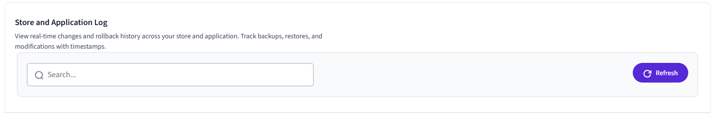

# Understanding Change Logs

##**1. Section title**

Shows the section title of the [Vortex Backup](index.md) app, a brief outline of the sections functionality and navigation tabs to click such as [**Dashboard**](understanding-the-dashboard.md), [**Restore Center**](understanding-restore-center.md), [**Change Logs**](understanding-change-logs.md) & [**Settings**](understanding-settings.md).

There are another 2 sub-tabs - ‘Change Logs’ which displays data grid of restore status) and ‘Webhook Logs’ which displays data grid of API responses from BigCommerce.

##**2. Store and Application log section**

This shows the section title, section overview, search box and refresh button to refresh all visible grid items.

**Search** - allows you to search for entries in the change log.
!!! note
    the entered text is searched for in the columns ID, Event and Status.

##**3. Logs grid**

###3a. “Change Logs” sub-tab

Clicking on the “Change Logs” sub-tab displays data grid containing the following:

- **ID** - change log unique identifier
- **Event** - description of change log event
- **Status** - shows change log status of Success/Failure
- **Date & Time** - date & time of the change log entry
- **View button** - This button is displayed only for ‘Failure’ status. Clicking this button will display a popup window with the message “We encountered an issue while processing your request due to a data mapping error with the BigCommerce API. Would you like our support team to investigate this and get back to you?”.

Clicking on the ‘Yes’ button will send an email to the support team ([**helpdesk@vortexiq.ai**](mailto:helpdesk@vortexiq.ai)) for troubleshooting purpose.

###3b. “Webhook Logs” sub-tab

Clicking on the “Webhook Logs” sub-tab displays data grid containing the following:

- **Log ID** - change log unique identifier
- **Entity** Data entity
- **EntityID -** Data entity unique identifier
- **Service -** Type of webhook
- **Error Message -** Response received from the BigCommerce API
- **Date & Time** - Date & time of the webhook log entry
- **View button** Clicking on this button displays the API response received from the BigCommerce API

##**4. Help Button**

Clicking the Help Button will open the corresponding Help page in the knowledgebase.

---

To view our Onboarding steps, please access the following article → [Backup Onboarding](viq-backup-onboarding.md)

---

[← Back to Help Center](../../index.md){ .md-button }