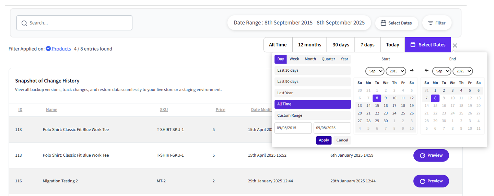
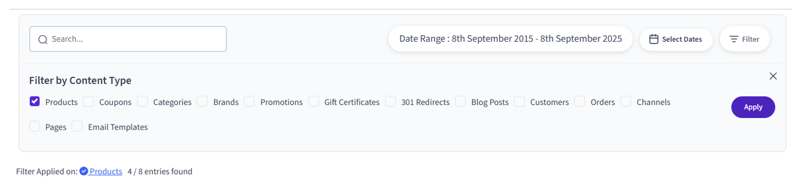
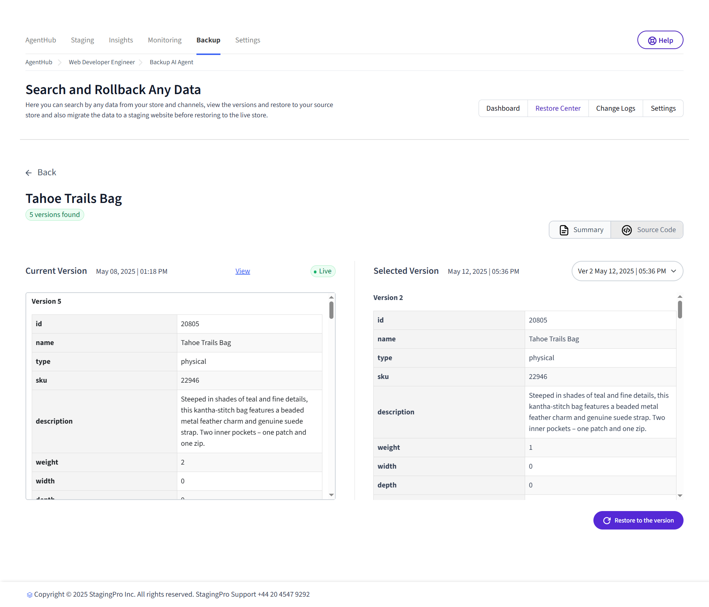
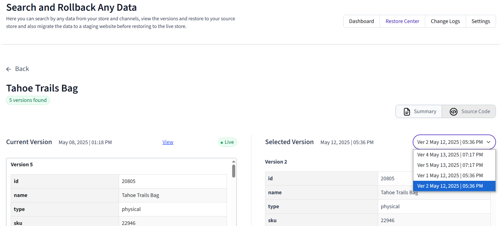

# Understanding Restore Center

This section enables users to search for specific data from their store or channels, view various versions of that data, and restore it to a chosen version. The restore functionality is essential for businesses needing to recover from issues such as data corruption, erroneous updates, or accidental deletions.

##**1. Section title**

Shows the section title of the [Vortex Backup](index.md) app, a brief outline of the sections functionality and navigation tabs to click such as [**Dashboard**](understanding-the-dashboard.md), [**Restore Center**](understanding-restore-center.md), [**Change Logs**](understanding-change-logs.md) & [**Settings**](understanding-settings.md).

##**2. Filters section**

You can use the following filter options:

### Textbox
specify a text word (e.g., infinity) and click the search icon or press enter key to obtain the results. 
!!! note
    The entered text is searched for in all the fields of all the products, not just Name and SKU.

### Date picker
Pick your date range by i) All Time ii) 12 months iii) 30 days iv) 7 days v) Today
    

    
You can also use the ‘Select Dates’ option to filter results by a specific date range. First, choose the start and end dates, then click the ‘Apply’ button. After that, click the ‘Submit’ button to confirm your selection and view the filtered results.

### Backup Entity (Content Type) Filter
You can also filter by Content Type to view tracked versions for a specific type. Please note that only one content type can be selected at a time. After selecting the desired type, click the ‘Apply’ button to display the filtered results.
    

    

##**3. Snapshot of Change History section**

Depending on the selected data entity type, the corresponding grid columns will be displayed. For example, if "Products" is selected, the grid columns will appear as follows:

- **ID** Displays BigCommerce’s Product Id of the product
- **Name** Displays Product name
- **SKU** Displays Product SKU (Stock Keeping Unit)
- **Price** Displays price at which the product was listed at the time of the backup.
- **Date Modified** - displays the date of the modification done to the product for the particular version.
- **Date Created** displays the date on which the first tracking record for your product was created.
- **Version** Displays the version number of the tracked changes made to the product. Each version represents a new backup instance or update of the data entry, helping users track how many changes have occurred to the specific product or data entity since its initial creation.
- **Preview button** - Under the Actions column, clicking this button will display the product information for both the current version (defaulting to the 'Summary' view) and the selected version side by side for comparison. After reviewing the differences, you can click the “Restore to this version” button to revert the product data to the selected version.

Clicking on 'Source code' will display the product data in JSON format, making it easier to compare different versions.

The version dropdown displays the tracked versions available for the product, allowing you to select any one to restore the data.

##**4. Help Button**

Clicking the Help Button will open the corresponding Help page in the knowledgebase.

---

To view our Onboarding steps, please access the following article → [Backup Onboarding](viq-backup-onboarding.md)

---

[← Back to Help Center](../../index.md){ .md-button }