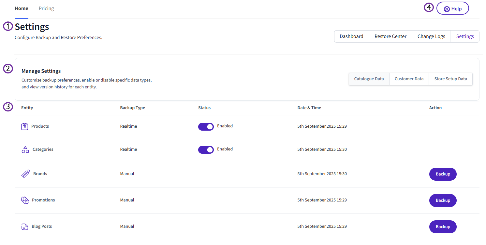
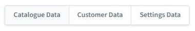
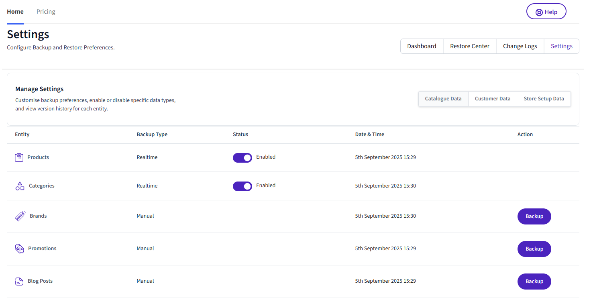
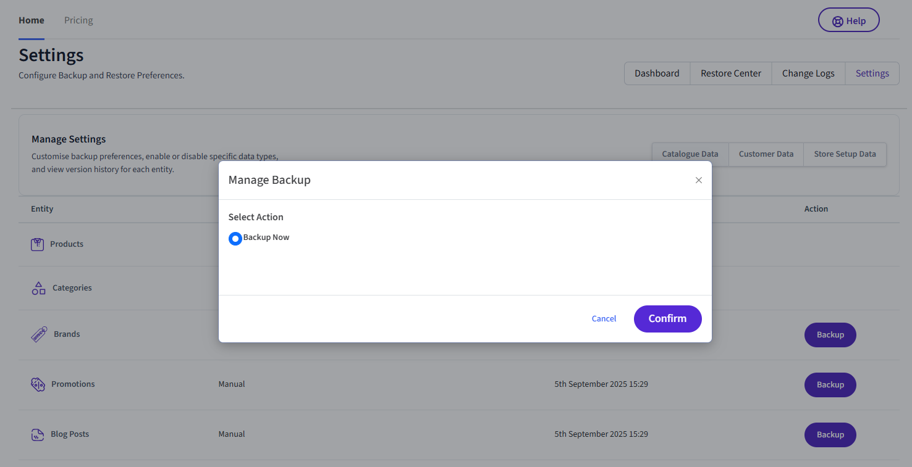

# Understanding Settings

##**1. Section title**

Shows the section title of the [Vortex Backup](index.md) app, a brief outline of the sections functionality and navigation tabs to click such as [**Dashboard**](understanding-the-dashboard.md), [**Restore Center**](understanding-restore-center.md), [**Change Logs**](understanding-change-logs.md) & [**Settings**](understanding-settings.md).

##**2. Manage Settings**

This shows the section title, section overview, backup entities and statuses, highlighting the scope of data backed up and their most recent backup times. This helps the user track the status of key business data entities in real-time

The data entities are grouped into 3 tab sections which you can click as applicable.

### Catalogue Data
    
This shows the store catalogue backup data that includes:

- Products
- Categories
- Brands
- Promotions
- Blog Posts

### Customer Data
    
This shows store customer backup data that includes:

- Customers
- Orders
- Coupons
- Gift Certificates

### Settings Data
    
This shows all the store setting related data is captured and shown.

- 301 redirects
- Channels
- Pages
- Email Templates

##**3. Grid Information**

Each grid item displays as follows:

- **Entity** shows the name of the data backup entity (e.g., Products)
- **Backup Type** - shows the backup type status of Realtime or Manual
- **Status** - allows you to enable or disable real-time backup sync
- **Date & Time** - shows the date & time of the last sync status
- **Action** displays ‘Backup’ button for ‘Manual' Backup type only

If you click the status and change it to Disabled, then the app stops listening to any webhook changes.

Clicking on ‘Backup’ , triggers the ‘Backup Now’ popup so you can click ‘Confirm’ the backup.

This will initiate full backup of the data and enable the realtime backup functionality again.

!!! important
    **Please ensure to take full backup manually before any major changes** by clicking on <u>‘Backup’</u> button, for the following data entities that do not have webhooks i.e., no realtime backup functionality, but <u>‘Manual'</u> backup type.	
	
	a) Brands
	
	b) Promotions
	
	c) Blog Posts
	
	d) Coupons
	
	e) Gift Certificates
	
	f) 301 Redirects

##**4. Help Button**

Clicking the Help Button will open the corresponding Help page in the knowledge-base.

---

To view our Onboarding steps, please access the following article → [Backup Onboarding](viq-backup-onboarding.md)

---

[← Back to Help Center](../../index.md){ .md-button }