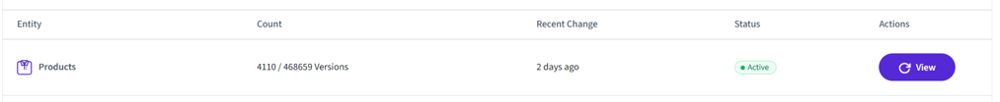

# Understanding the Dashboard

##**1. Section title**

Shows the section title of the [Vortex Backup](index.md) app, a brief outline of the sections functionality and navigation tabs to click such as [**Dashboard**](understanding-the-dashboard.md), [**Restore Center**](understanding-restore-center.md), [**Change Logs**](understanding-change-logs.md) & [**Settings**](understanding-settings.md).

##**2. Store and backup/sync info**

This shows the following information:

- **Store Name** - displays the name of your BigCommerce store
- **Store Identifier** - displays the store hash value of your BigCommerce store
- **App Data Backup From** - The date and time of the oldest order in the backup
- **Most Recent Change Received** - This is the date and time of the most recent data change recorded on the system through real-time change tracking.
- **Sync Status** - Indicates whether real-time synchronization is currently **Active** or **Paused** for all the BigCommerce webhook-based data elements the app is subscribed to. These are the entities the app monitors via webhooks to detect changes and perform backups accordingly.
    
Users can disable real-time (live) sync via the **Settings** tab, which is useful in scenarios where data synchronization needs to be temporarily paused.

The **Sync Status** will be displayed as:

- **Active** – if at least one entity is enabled
- **Paused** – only when **all** entities are disabled

##**3. Snapshot of backup section**

This section displays the backup entities and statuses, highlighting the scope of data backed up and their most recent backup times. This helps the user track the status of key business data entities in real-time.

!!! note 
    Please refer to the [Vortex Backup Known Issues](viq-backup-known-issues.md) page to know about any issues or limitations of the app functionalities or data displayed in the app.
	
The data entities are grouped into 3 tab sections which you can click as applicable.

### Catalogue Data
    
This shows the store catalogue backup data that includes:

- Products
- Categories
- Brands
- Promotions (Automatic + Coupon)
- Blog Posts (Storefront > Blog)

### Customer Data
This shows store customer backup data that includes:

- Customers
- Orders (Total of active, archived and incomplete orders including orders with declined payment status also)
- Coupons (Marketing > Coupon code + Marketing > Promotions >Coupon tab)
- Gift Certificates (Orders > Gift certificates)

### Settings Data
    
This shows all the store setting related data is captured and shown.

- 301 redirects (Settings > Domain > 301 Redirects)
- Channels
- Pages (Channels > Edit storefront settings > Web pages)
- Email Templates (Marketing > Transactional emails + Marketing > Abandoned cart emails)

Each grid item displays as follows:

- **Entity** shows the name of the data backup entity (e.g. Products)
- **Count** - shows the count of the number of data items (e.g. Product count of 4110) and version count of all the tracked Products changes
- **Recent Change** - showing the last tracked change for the data item (e.g. Products)
- **Status** - indicating whether the real-time backup sync is Active
- **View button** - Clicking this button takes you to the [Restore Center](understanding-restore-center.md) for the selected data backup entity which displays the tracked versions

**Refresh button**

Click the button to refresh data items in the visible grid.c

##**4. Help Button**

Clicking the Help Button will open the corresponding Help page in the knowledgebase.

---

To view our Onboarding steps, please access the following article → [Backup Onboarding](viq-backup-onboarding.md)

---

[← Back to Help Center](../../index.md){ .md-button }