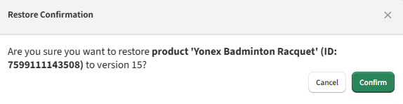
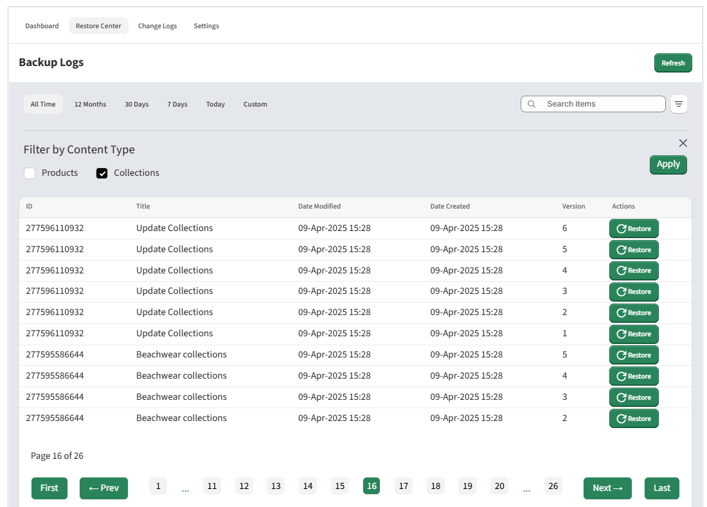
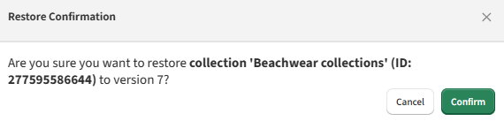

# Understanding Restore Center

This section enables users to search for specific data from their store or channels, view various versions of that data, and restore it to a chosen version. The restore functionality is essential for businesses needing to recover from issues such as data corruption, erroneous updates, or accidental deletions.

## Restore Button
Clicking on the restore button corresponding to the version displays the details of current version and the selected version.

Click on this article to know which data entities and their fields are being taken backup:

[Data Entities for Backup and Restore](what-we-backup-and-rollback.md)

**Products**

Version differences of a product

Clicking on “Restore to the version”, displays a popup window asking for confirmation. After confirming the product data is restored to the selected version.

**Collections**

Version differences of a collection

Clicking on “Restore to the version”, displays a popup window asking for confirmation. After confirming the collection data is restored to the selected version.

## Help Button

Clicking the "Help" button will open the corresponding Help page in the knowledgebase.

---

Click here → [Understanding the Backup App pages](app-pages/index.md) to understand other pages of the app.

To view our Onboarding steps, please access the following article → [Backup Onboarding](backup-onboarding.md)

---

[← Back to Help Centre](../../index.md){ .md-button }
