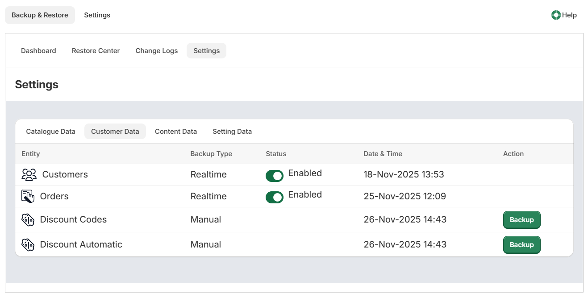
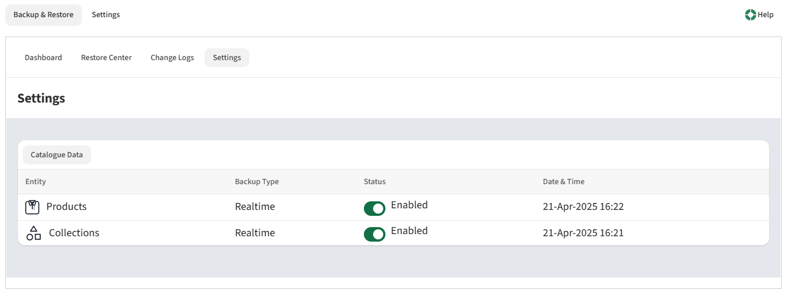

# Understanding Settings

The data entities are grouped into 4 tab sections which you can click as applicable.

### Catalogue Data
    
This shows the store catalogue backup data that includes:

- Products
- Collections

### Customer Data
    
This shows store customer backup data that includes:

- Customers
- Orders
- Discount Codes
- Discount Automatic

### Content Data

This shows store content backup data that includes:

- Blogs
- Pages
- Files

### Settings Data
    
This shows all the store setting related data is captured and shown.

- Themes
- Gift Cards

## Grid Information

Each grid item displays as follows:

- **Entity** shows the name of the data backup entity (e.g., Products)
- **Backup Type** - shows the backup type status of Realtime or Manual
- **Status** - allows you to enable or disable real-time backup sync
- **Date & Time** - shows the date & time of the last sync status
- **Action** displays ‘Backup’ button for ‘Manual' Backup type only

If you click the status of Realtime Backup Type and change it to Disabled, then the app stops listening to any webhook changes.

**Realtime backup enabled:**

Enabling the realtime backup, will display the dashboard as follows:

**Realtime backup disabled:**

Disabling the realtime backup, will display the dashboard as follows:

**Manual Backup** 

Clicking on ‘Backup’ corresponding to the manual backup type data entity, triggers the ‘Backup Now’ popup so you can click ‘Confirm’ the backup.

!!! important
    **Please ensure to take full backup manually before any major changes** by clicking on <u>‘Backup’</u> button, for the following data entities that do not have webhooks i.e., no realtime backup functionality, but <u>‘Manual'</u> backup type.	
	
    a) Discount Codes
	
	b) Discount Automatic
	
	c) Blogs
	
	d) Pages
	
    e) Files
	
	f) Themes
	
	g) Gift Cards
	

## Help Button

Clicking the "Help" button will open the Help page in the knowledgebase.

---

Click here → [Understanding the Backup App pages](app-pages/index.md) to understand other pages of the app.

To view our Onboarding steps, please access the following article → [Backup Onboarding](backup-onboarding.md)

---

[← Back to Help Centre](../../index.md){ .md-button }