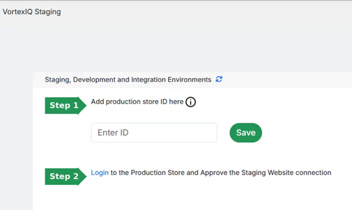
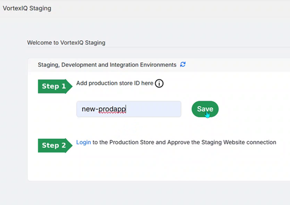
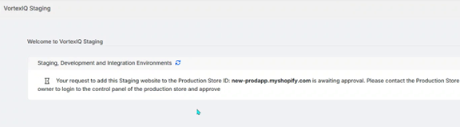
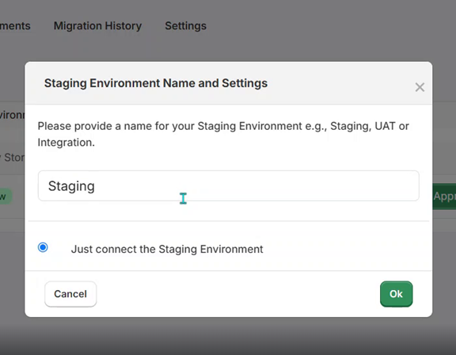
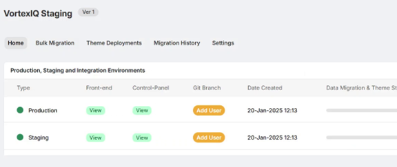

# Onboarding

This section guides you through the recommended setup so your environments and workflows are organised from day one. The exact features available depend on your Vortex Staging licence plan.

## **Quick setup (Environments)**

### **Step 1: Plan your environments**

Vortex Staging is available in three licence tiers. Each tier provides a defined number of connection slots for linking non-production environments to your Production store:

  * Standard Tier: Production plus 2 connection slots
  * Plus Tier: Production plus 3 connection slots
  * Premium Tier: Production plus 5 connection slots

Before linking stores, plan your environment names and intended purpose. Clear naming prevents mistakes and helps teams communicate accurately.

Suggested best-practice naming:

  * Production (reserved name – cannot be changed)
  * Staging
  * UAT
  * Integration1
  * Integration2
  * Integration3

It is helpful to prepare a simple reference table for your own records, for example:

<table><tbody><tr><td>
<strong>Proposed environment name</strong>
</td><td>
<strong>Store ID</strong>
</td><td>
<strong>Description</strong>
</td></tr><tr><td>
Production
</td><td>
prod-app
</td><td>
Live store
</td></tr><tr><td>
Staging
</td><td>
stage-app
</td><td>
Pre-deployment store for smoke tests
</td></tr><tr><td>
UAT
</td><td>
uat-app
</td><td>
User acceptance testing store for production builds
</td></tr><tr><td>
Integration
</td><td>
integ-app
</td><td>
System integration checks
</td></tr></tbody></table>

Planning upfront helps you confirm the correct environment names during linking and avoids mixing production and non-production stores.

### **Best practice naming conventions and testing guidance in Vortex Staging environments**

As a general rule, perform early testing and trial migrations in non-production stores first. This helps you understand the tool’s behaviour safely and keeps live customer operations protected.

Only after comprehensive testing and validation should you migrate data to a live Production environment.

### **Step 2: Check that the Vortex Staging App is installed on required stores**

After you sign the subscription licence agreement and the Vortex Staging App is installed on the relevant Shopify stores, share the store IDs with Helpdesk. They can assist with linking the environments within your tenant. Provisioning typically completes within 2–3 working days.

### **Step 3: Link additional environments to Production**

!!! Important
    Helpdesk Can complete the linking process for you as part of provisioning.   
    If you are linking environments yourself, the steps below outline the expected flow.

With Vortex Staging installed on the Production store, locate the Production store ID (sometimes referred to as the production hash ID) as shown below:

Open the Vortex Staging interface in your destination sandbox store. Enter the Production store ID into the ID field and click Save.

!!! IMPORTANT
    Enter the **production hash ID only** in the ID field of the respective sandbox store.

An invitation request will appear on the destination sandbox store.

Open Vortex Staging on the Production store and refresh the page. You will see the invitation request and must accept it to complete linking.

Click Approve, enter a target environment name (for example, Staging), and click OK.

Refresh the dashboard. You should now see Production and the newly linked environment listed as connected.

!!! Note
	**Production is a restricted, reserved name used by the application** and cannot be renamed.

To access all areas of your store’s Shopify Admin (including sandbox stores), you typically need Store Owner access.

See Shopify documentation for Store Owner user roles and permissions.

### **Step 4: Add GitHub accounts**

&nbsp;

### **Step 5: Setup Notifications**

* Setup notifications in Slack
* Setup notifications in Teams
* Setup notifications by Email

### **Step 6: Test migrations**

Once you are setup test firstly a content migration followed by a product catalog migration

!!! IMPORTANT
    Perform comprehensive testing and validation in non-production environments first. Only after validation and approval should you migrate data to a live Production environment.

Please note that some data elements (for example, Promotions) may automatically migrate related data due to dependencies. Review known issues and release notes (Link to page) before running a test migration.

## **Migration types: Bulk vs Selective**

### **Bulk Migration**

Bulk migration creates records in an empty destination store. **Vortex Staging assumes the entities do not exist on the destination and will create them**. If entities already exist, the migration will log errors. Bulk migration does not update existing records.

When Products are selected, product stock inventory count should migrate by default. This is dependent on having the same locations already created in the destination store. If no destination location has been created then inventory will be stored in the default location.

!!! NOTE
    New product IDs may be linked to orders during a bulk content migration.

### **Selective Migration**

Selective migration is intended for updating records in an existing destination store.

#### **Products**

If products already exist on the destination store, they can be updated during a selective migration. Products with multiple variation items may be deleted and recreated on the target store as part of the update process.

Selective Product Migration includes a Copy All Products option, which runs a selective update across all products as an on-demand task.

By default, product stock count does not migrate unless you enable the checkbox in the popup: “Migrate Product Stock inventory count to target store.”

**Images:** If you delete product images on the source store and run a selective product migration, the corresponding images are not removed from the destination SKU. If you want images removed on the destination, delete them manually in Shopify Admin.

#### **Themes**

Themes can be migrated selectively from source to destination. Select the theme you want and use Copy Theme to start the migration.

Additional data entities such as Collections, Files, Discounts, Pages, and others are planned for inclusion in Selective Migration in a future sprint.

## **Time taken for data migrations**

Migration duration varies. It depends on data volume, dependencies, Shopify API throttling, connection speed, and other factors. Some migrations complete in seconds; larger migrations can take hours and in extreme cases, days.

## **FAQs**

For quick reference, here are some [FAQs](../staging-faqs.md)

## **Knowledgebase**

The knowledgebase URL is → [Welcome to Vortex Staging](../index.md)

## **Support Tickets Helpdesk**

* Support ticket portal URL is → [https://helpdesk.vortexiq.ai/portal/en/home](https://helpdesk.vortexiq.ai/portal/en/home), which is the correct channel to log any support ticket requests for the Helpdesk team to review.
  * you can track all of your tickets here as well as search for knowledge base articles
  * Using the Support Ticket portal helps with faster team assignment for investigation and resolution
  
* Email (creates a ticket): <a title="mailto:helpdesk@stagingpro.com" href="mailto:helpdesk@stagingpro.com">helpdesk@stagingpro.com</a>, however Support ticket portal is the best way to reach out to Helpdesk

!!! IMPORTANT
    For support troubleshooting, the Vortex Staging tech team may request access mainly to sandbox stores, but temporary Production store access will be requested as appropriate. As with Bulk Migration behaviour, items on the target sandbox store will need to be deleted before attempting a migration to ensure the migration happens correctly. 
	
	Please ensure that:
    **You do not store important, business critical or development essential data on a sandbox store as this is for test migrations only! Keep your configuration settings safe elsewhere.**
    
	If there is any information we need to be aware before granting access to our tech team for troubleshooting e.g.,

    i) data on staging that you’re team is actively working on and you wish to retain

    ii) your development workflow processes we need to be aware of, 
	
	please let us know <u>before access is granted and our testing begins</u>.
	

## **Support Phone Number**

* **StagingPro Support** +44 20 4547 9292

---

[← Back to Help Centre](../../index.md){ .md-button }