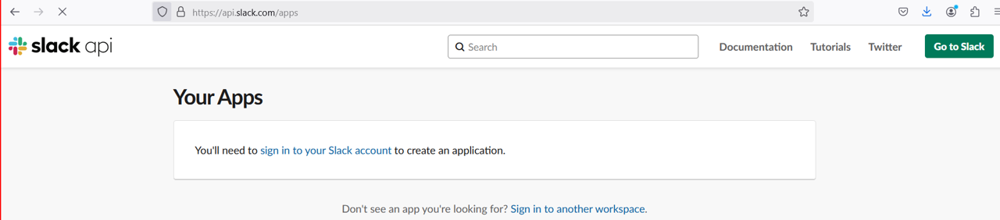
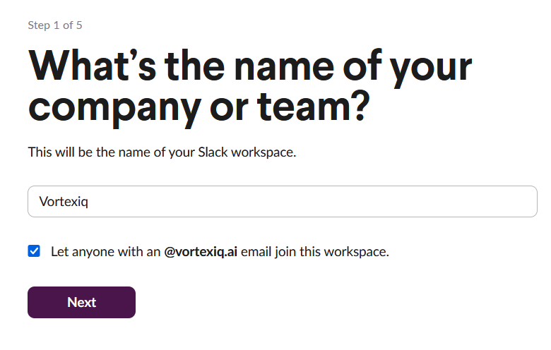
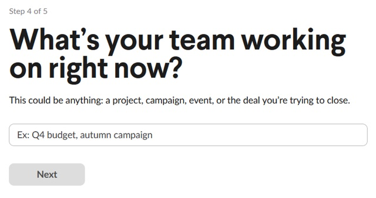
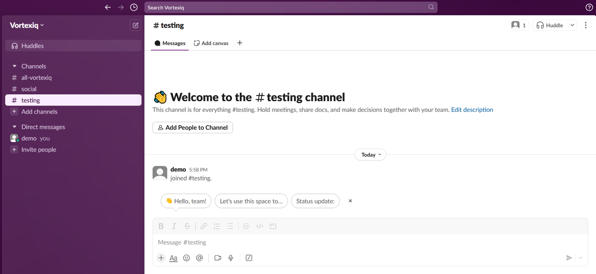
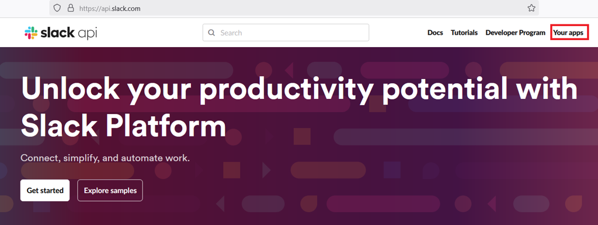
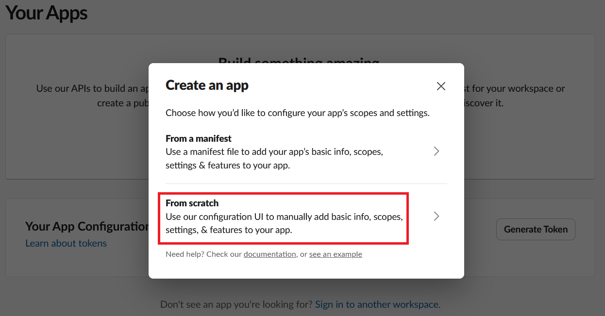
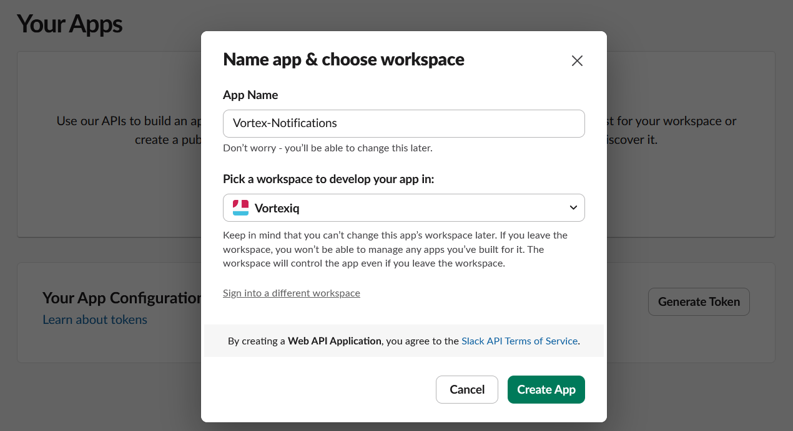
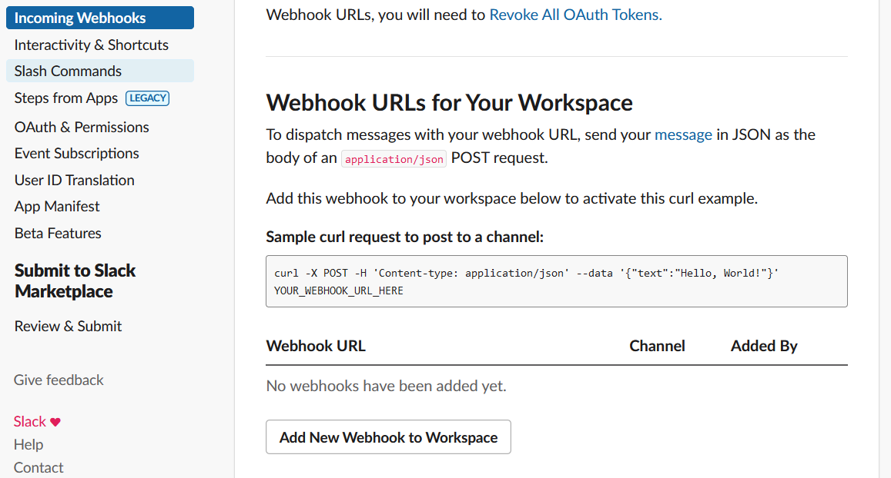
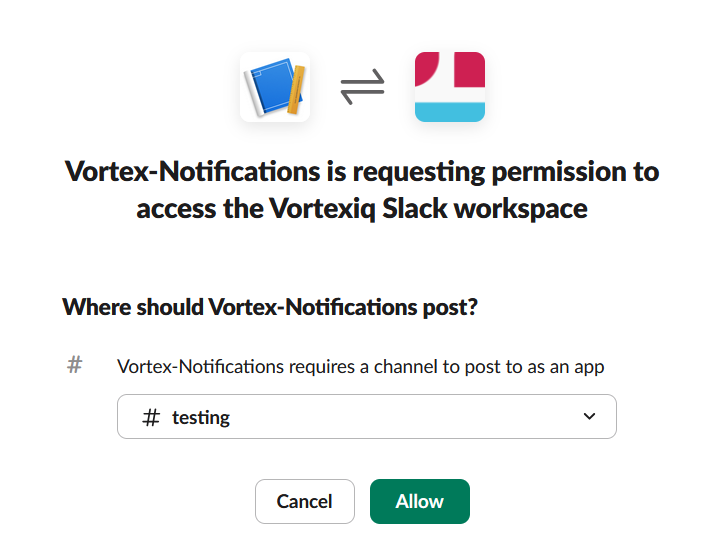
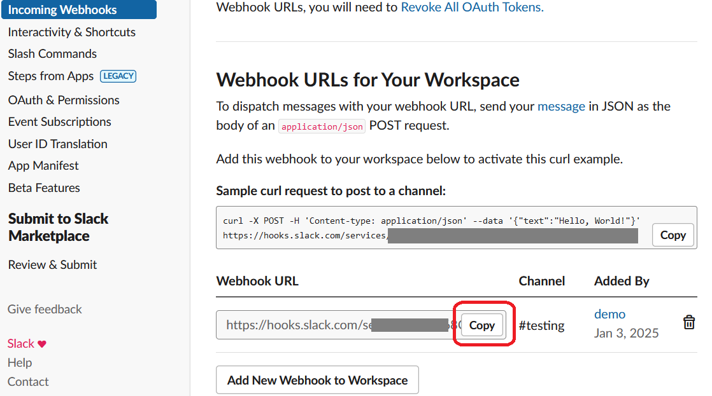

# Setup notifications in Slack

Communication between team members is vital in any development project, and keeping in touch with teams working remotely and across different time zones is more important than ever. Vortex Staging has the native ability to send notifications to Slack (and other channels) each me a deployment event occurs.

Slack integration is supported through Incoming Webhooks. Once configured, Vortex Staging can post status messages into a chosen Slack channel.

Before you begin, create a Slack workspace (if needed) and create a channel where notifications should be delivered. You will then create a Slack App and enable Incoming Webhooks for it.

## ****Steps to set up a Slack webhook**

This document assumes that you already have Slack installed in your organization. You will find detailed instructions here if you need assistance downloading and installing Slack.

**Step 1:** From a new browser tab/window, go to api.slack.com

**Step 2:** Click Your apps on the top right hand corner.

**Step 3:** Click the Go to Slack button on the top right hand corner to sign into your Slack account.

**Step 4:** Sign into your Slack account.

**Step 5:** Click on Create a workspace, enter your company or team name, then click Next.

**Step 6:** Enter your name

**Step 7:** Invite your coworkers by entering their email addresses and click Next. You may also skip this **Step for the moment.

**Step 8:** Enter the necessary details (for example, a workspace name such as Testing) and click Next. Your workspace is ready.

**Step 9:** The testing channel will be created and is ready for communication.

**Step 10:** To enable the webhook, go back to api.slack.com, click Your apps, and then click Create an App.

**Step 11:** When the Create an app window appears, select From scratch.

**Step 12:** Give your app a name and choose your company's Slack workspace from the dropdown.

!!! IMPORTANT
    If the workspace dropdown is empty, go back to api.slack.com and ensure you are signed into Slack.

**Step 13:** Click Create App, then select Incoming webhooks from the left menu. Switch Activate Incoming Webhooks to On, then click Add New Webhook to Workspace.

**Step 14:** Click Add new webhook to the workspace and grant permissions. The webhook will be created.

**Step 15:** When prompted, select the channel you created and click Allow.

**Step 16:** Copy the generated webhook URL using the Copy button.

**Step 17:** Paste the copied webhook URL into Vortex Staging under Settings -&gt; Status Notifications -&gt; Slack, then click Add.

Enter the test message and click send button.

A confirmation message will be displayed indicating successful delivery.

**Step 18:** Open Slack and navigate to the channel used for the webhook. You should see the notification message posted there.

---

Click here → [Understanding the Staging App pages](app-pages/index.md) to understand other pages of the app.

To view our Onboarding steps, please access the following article → [Staging Onboarding](staging-onboarding/index.md)

---

[← Back to Help Centre](../../index.md){ .md-button }