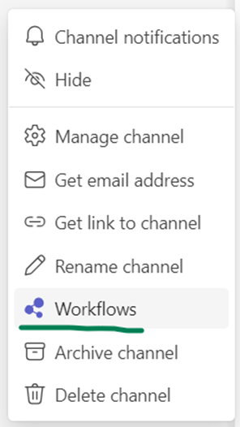
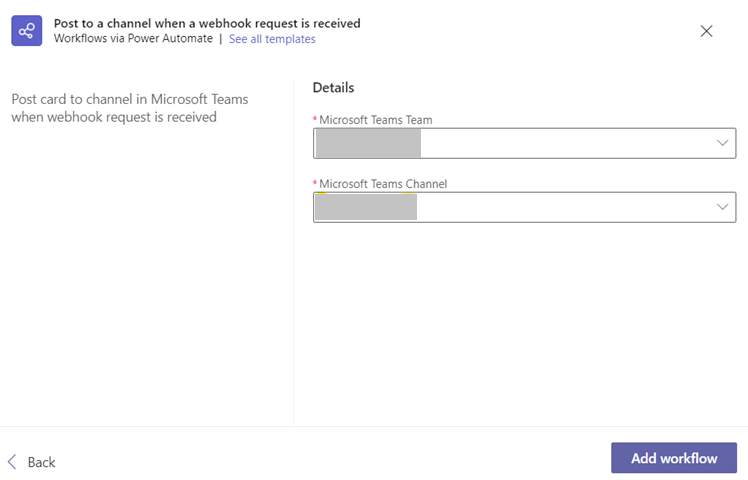

# Setup notifications in Teams

Microsoft Teams integration is supported using Teams Workflows. Once configured, Vortex Staging can post notifications directly into the selected Teams channel.

## **Steps to set up a Teams workflow**

1. In the new Teams client, select Teams and navigate to the channel where you want to receive notifications.

2. Select More options (•••) on the right side of the channel name and click Workflows.

3. Click on "Post to a channel when a webhook request is received".

4. Enter the name of the workflow and click Next.

5. Click Add workflow.

6. Copy and save the unique workflow URL shown in the dialog. This URL maps to the channel and is used by Vortex Staging to send messages. Select Done.

7. Paste the copied workflow URL in Vortex Staging under Settings -&gt; Status Notifications -&gt; Teams, then click Add.

---

Click here → [Understanding the Staging App pages](app-pages/index.md) to understand other pages of the app.

To view our Onboarding steps, please access the following article → [Staging Onboarding](staging-onboarding/index.md)

---

[← Back to Help Centre](../../index.md){ .md-button }