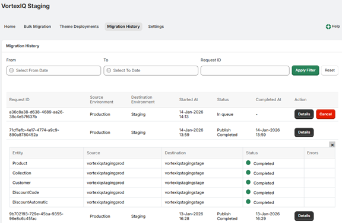

# Migration History

The Migration History screen provides a record of all migrations you have run. It includes the Request ID, source and destination environments, start time, status, completion time, and available actions.

For completed migrations you will see a Details button. For migrations that are still running, you will typically see both Details and Cancel.

Selecting Details shows the status of each migrated entity and any errors that occurred. You can also filter results by date range or by Request ID to find a specific migration.

---

Click here → [Understanding the Staging App pages](app-pages/index.md) to understand other pages of the app.

To view our Onboarding steps, please access the following article → [Staging Onboarding](staging-onboarding/index.md)

---

[← Back to Help Centre](../../index.md){ .md-button }