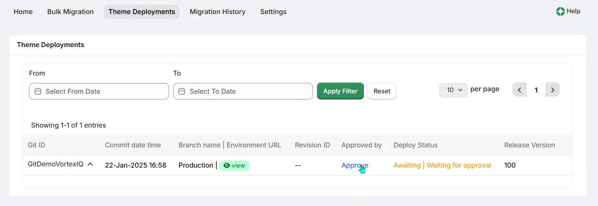
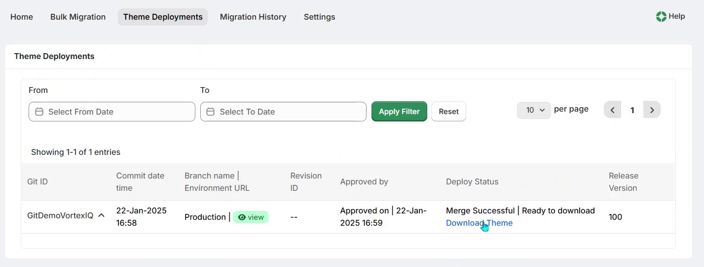
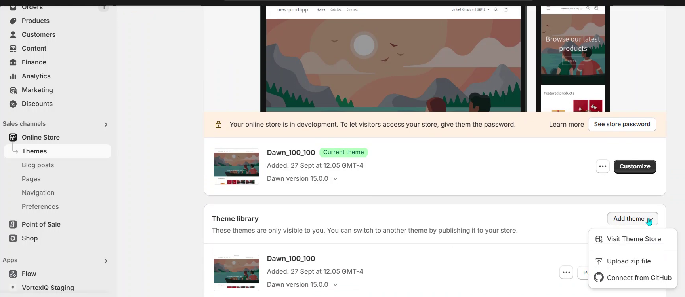

# Theme Deployments

This page displays all theme deployments committed to GitHub and awaiting approval before being deployed to the production environment.

!!! IMPORTANT
    **You must connect your GitHub repository under the ‘Settings’ tab &gt; Connect Repository section before you can use this function.**

After the deployment is approved, the app will start building the theme files. Once the theme files are successfully built, the download link for the theme will be enabled.

Then upload the theme file you just downloaded, using the ‘Upload theme’ file option in the Shopify control panel.

Finally, click the Theme ‘Preview’ option to view the updated Theme file changes, seen as a front-end url preview.

The modified text will be displayed on the home page in the theme’s preview url.

---

Click here → [Understanding the Staging App pages](app-pages/index.md) to understand other pages of the app.

To view our Onboarding steps, please access the following article → [Staging Onboarding](staging-onboarding/index.md)

---

[← Back to Help Centre](../../index.md){ .md-button }