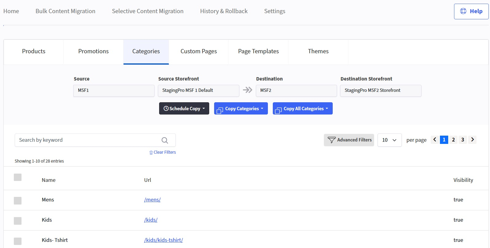

# Understanding Selective Content Migration

Using **Selective Content Migration**, you can update supported data entities individually — such as a single Product, Promotion, Category, Page or Layout — on the destination environment (store or storefront).

---

### Feature Notes

- **Schedule Copy** is a Premium feature and does *not* apply to Pages and Layouts Selective Migration.
- **Copy Some** allows you to update only selected checkbox items from source to destination.
- **Copy All** updates all items from source to destination.
- Use **Advanced Filters** and pagination (items per page) to refine your results and make specific selections.
- **Clear Results** resets filter view.
- A **Select All** checkbox is available for selecting everything on the current page.

---

### Interface Screenshots

**Products**

**Promotions**

**Categories**

---

### Related Topic

For Pages and Layouts selective migration, please refer to:

👉 **[Content Migration: Pages and Layouts](pages&layouts.md)**

---

## Premium Features

The following features are available only in the **Premium Plan**:

- **[Schedule Migration**](../stagingpro-scheduling.md)**
- **[B2B Migration**](../stagingpro-bundle-b2b-support.md)**

---

Click here → [Understanding the StagingPro App pages](../app-pages/index.md) to understand other pages of the app.

To view our Onboarding steps, please access the following article → [StagingPro Onboarding](../stagingpro-onboarding/index.md)

---

[← Back to Help Center](../../index.md){ .md-button }