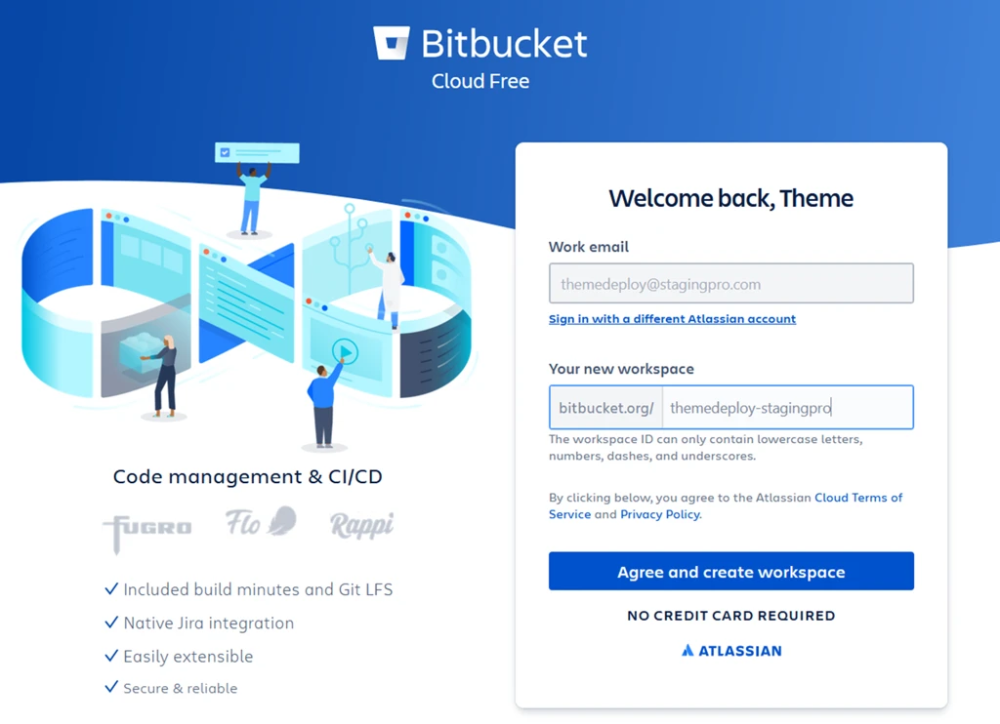
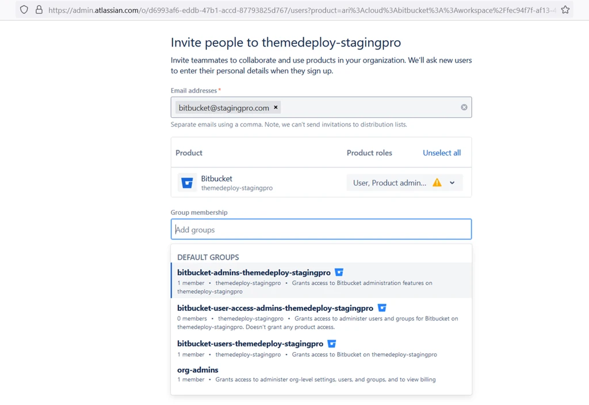
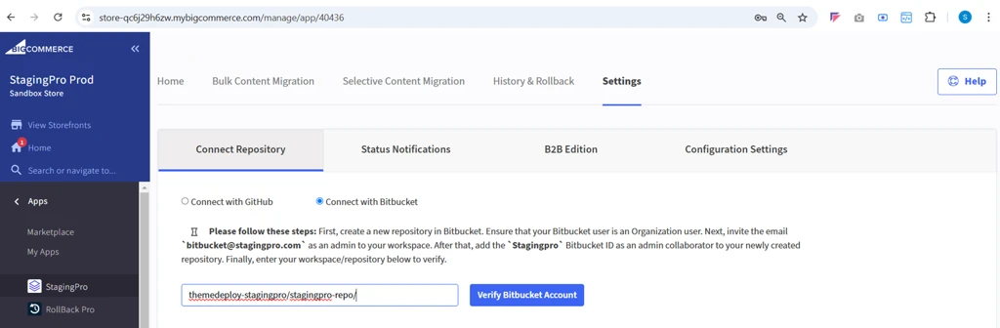
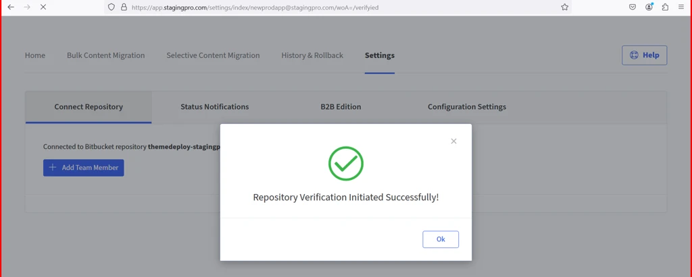
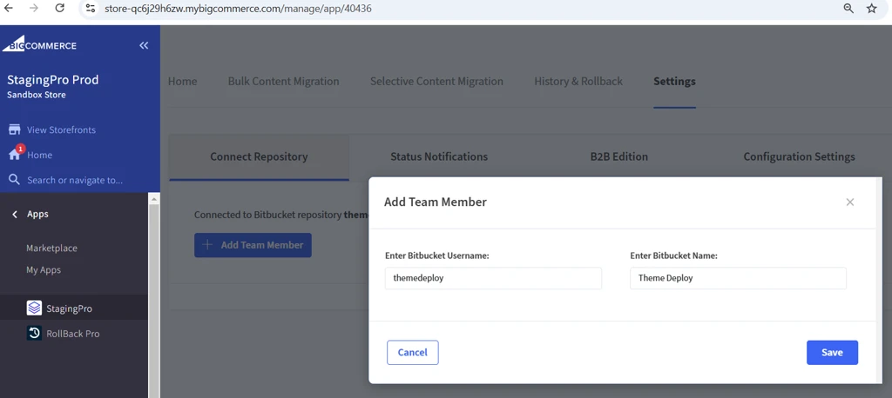
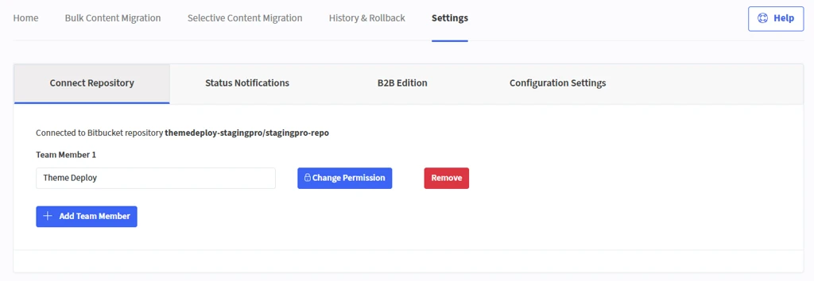
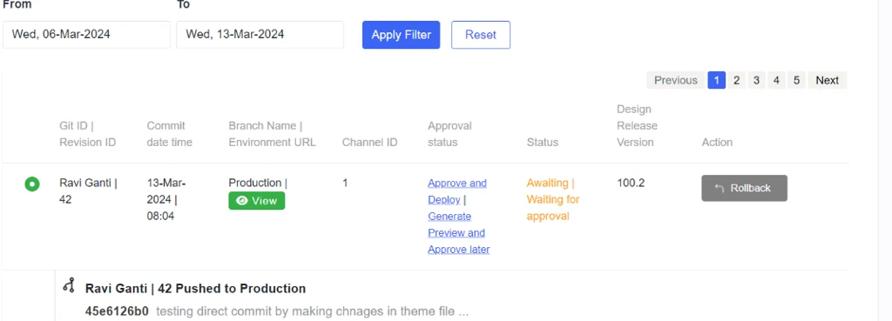
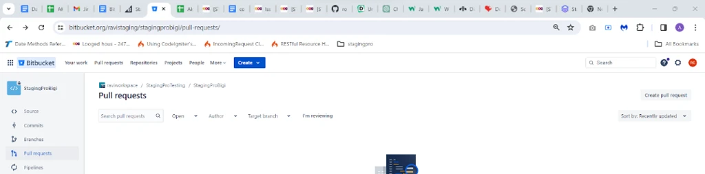
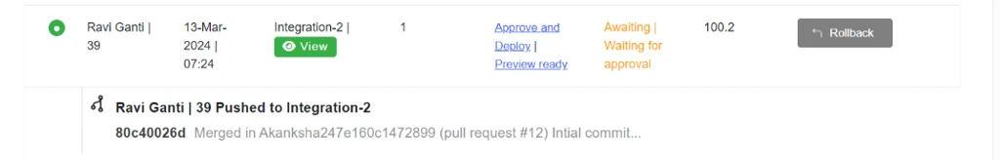
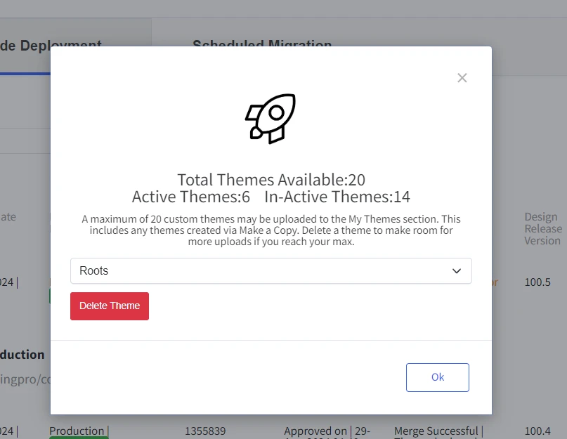

# Bitbucket Integration

## Bitbucket Account Setup

#### Step 1: Sign up or log in to Bitbucket Account

· Visit Bitbucket's official website, create an account, and log in.

#### Step 2: Create Workspace

· Upon logging in, click “Create workspace.”

· Provide the workspace details and proceed.

#### Step 3: Create Repository

· **Add Repository:**

o Enter Project Name

o Enter Repository Name

o Set Access Level

o **Important**: Always set the default branch name as "main."

· After successfully creating the repository, a URL similar to this will be generated: `https://bitbucket.org/{workspace}/{repository}/src/main/`.

<u>in stagingpro you need URL like this workspace/repository e.g.,</u>[“themedeploy-stagingpro/stagingpro-repo/](https://bitbucket.org/themedeploy-stagingpro/stagingpro-repo/src/main/)”

#### Step 4: Add User to Bitbucket Workspace and Repository

1\. Navigate to the repository and click on the settings icon.

2\. Go to "User Management" and click on "Invite."

3\. Here click on Invite button and the redirect to Invite people to Bitbucket screen.

§ Enter the [bitbucket@stagingpro.com](mailto:bitbucket@stagingpro.com)

§ There are 3 product roles, click on the drop down field and select all of them

§ User

§ Product admin

§ User access admin

4\. There are 4 group permissions:

· bitbucket-admins

· bitbucket-user-access-admins

· butbucket-users

· org-admins

**Select the group permission "bitbucket-admins-themedeploy-stagingpro"**

5\. Click on Invite users button to send the invitation

6\. For additional users:

o Assign developer permissions.

o Follow similar steps, but assign different permissions.

#### Step 5: Verify Repository

1\. Log in to StagingPro and connect to Bitbucket.

2\. Enter the repository URL in StagingPro under **Settings &gt; Connect Repository**.

3\. Click on Verify Bitbucket Account, Grant access and you will receive a success message.

#### Step 6: Add Team Members

1\. Click on Add Team member, a popup window to enter Bitbucket username and Bitbucket name will be displayed

2\. To get username and name, sign into Bitbucket account, click on the settings cog wheel on the top right-hand corner and then click on “Personal Bitbucket Settings” [https://bitbucket.org/account/settings/](https://bitbucket.org/account/settings/)

3\. In the following screenshot, you can get the Bitbucket name and Bitbucket username as follows:

* Bitbucket Name: Theme Deploy
* Bitbucket Username: themedeploy

4\. Enter the Bitbucket username and Bitbucket name and click on save. Then the following popup window to select the environment type will be displayed. Click the checkbox on the desired environment for branch creation and click on confirm button.

**IMPORTANT**: The ‘Team Member’ you add on StagingPro must also have the access permissions to the Bitbucket repository workspace.

#### Step 7: Change Permissions / environment type

Click on the Change permission button to remove existing environment or select any other environment.

#### Step 8: Remove User

To remove a user, click "Remove" in StagingPro. This action removes the user from StagingPro but not from Bitbucket.

1\. Go to Code Deployment screen wherein you can see the direct commit changes as follows:

2\. By clicking on “Generate Preview and Approve Later” link user can launch Preview for direct commit

3\. Workflow for Pull Request - Click on “Approve and Deploy to initiate deployment

* Create Pull request in your bitbucket account under repository section
* See the left menu and click on “Pull request”

4\. Click on create pull request on the top right side then select the Environment branch for the destination branch dropdown.

5\. You will see this screen where you can add your comment and then click on “approve” and “merge”

6\. After clicking merge you will see this screen

7\. You can add your comment but do not made modifications on top commit message like “Merged in Akanksha247e160c1472899 (pull request \#12)” and simply click on “Merge” button Then you will start seeing entries like this under “Code Deployment”

8\. Here you can see the generate Preview link click on “Generate Preview and Approve Later” link and select the correct note version from dropdown and then again click on “Launch Preview” button.

After generating Preview you will see screen like this

Click on “Preview Ready”

Click on Top link like this “[https://fifty-olives-prove.loca.lt](https://fifty-olives-prove.loca.lt/)” to see the preview.

Click on Approve and Deploy then you will see screen like this

After some time refresh the page and click on "Deployment logs" and by going down see latest comment similar like this “Bundled saved to: 20240223-6.5.0.zip which means theme is downloaded properly and now the stencil server Cron will pick the theme and do the deployment.

**Maximum Theme Notification:**

In some case if user already have maximum no of theme which is 20 then user will see screen below screen then please select the theme user want to delete, click ok and then refresh the page to see the update.

---

Click here → [Understanding the StagingPro App pages](app-pages/index.md) to understand other pages of the app.

To view our Onboarding steps, please access the following article → [StagingPro Onboarding](stagingpro-onboarding/index.md)

---

[← Back to Help Center](../../index.md){ .md-button }