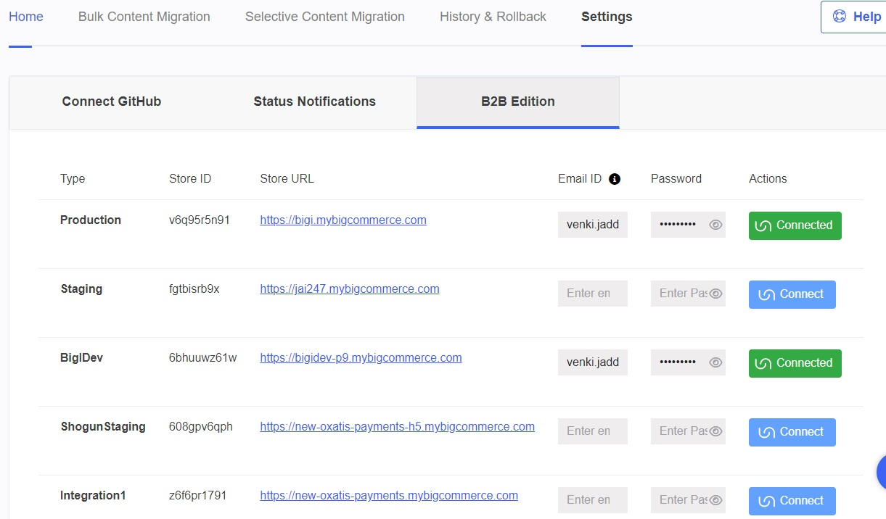
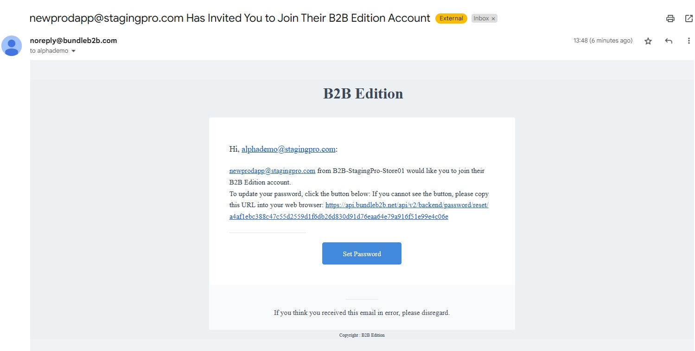
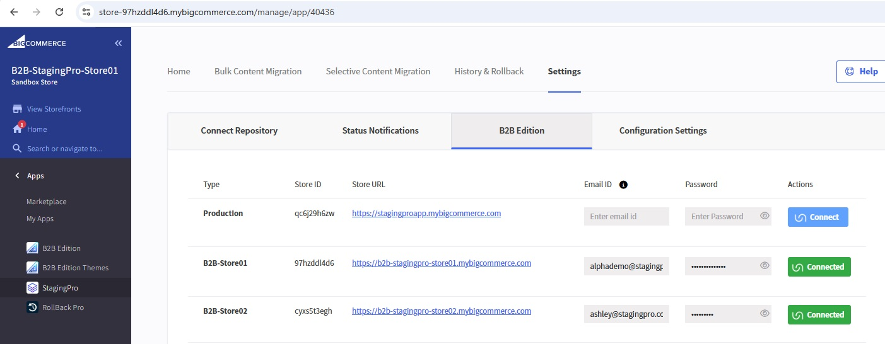

# B2B Edition / Bundle B2B Support

This integration requires the Bundle B2B APIs to be added on the **Settings** page of StagingPro.  
The application's **Settings > B2B Edition** tab lists all the connected Store Environments.

---

!!! note
	Before proceeding, ensure that your store’s **B2B Edition app** is both installed and successfully activated by BigCommerce.  
	Please reach out to your assigned BigCommerce point of contact (Account Executive or Support) to confirm activation.

---

!!! important
	For an easy and straightforward connection, use a **fresh, dedicated email ID** that is **not present** (and has **never been used**) on the BigCommerce Control Panel, as this email will be used only with the B2B Edition app.

	Example:  
	Use an email like **b2b@yourdomain.com** in the B2B panel under **Settings > System Users and Roles**, and add it with **Admin** role.

---

## Steps to Connect to Environments

### 1. Create a B2B User
The connection works only if you create a B2B user using the **manual process** described in BigCommerce documentation.

#### Manual Account Creation
If you want to specify user account information before granting access to B2B Edition:

1. Go to **Settings › System users and roles** in the B2B Edition control panel  
2. Open the **Users** tab  
3. Click **Add User**  
4. Available in both **All** and **Sales staff** sections

When you add a user email ID to the B2B Users section, an automated email is sent prompting the user to set a password for B2B access.

---

### 2. Set the Password
When the email is received, set the password for the newly created B2B Edition account.

The **email ID + password** created here is what enables the successful B2B connection for each environment.

After entering the required details in StagingPro, click **Connect** to link the environment.

---

!!! important
	You must see the **Connected** status for the B2B entities to appear correctly in the **[Bulk Content Migration](understanding-bulk-content-migration.md)** tab.
	
A store environment with Bundle B2B support will appear under the Bulk Content Migration tab once connected.

---

## Troubleshooting the Connection Issues

While not mandatory, it may help to have the B2B user also created as a **BigCommerce Control Panel user**  
E.g., user *alphademo* set as both a B2B user and a BigCommerce Control Panel user using the same email ID.

However, please remember:

- **B2B Edition credentials are separate** from BigCommerce CP credentials.
- Only the password set through the automated B2B email is used for B2B authentication.

You may also try:

- Deleting the B2B user in the B2B portal  
- Recreating it  
- Resetting the password  
- Attempting the connection again

---

Click here → [Understanding the StagingPro App pages](app-pages/index.md) to understand other pages of the app.

To view our Onboarding steps, please access the following article → [StagingPro Onboarding](stagingpro-onboarding/index.md)

---

[← Back to Help Center](../../index.md){ .md-button }