# GitHub Integration

## GitHub Account Setup

If you use GitHub for code deployments, you can integrate it with StagingPro!

Under the ‘Settings’ &gt; ‘Connect Repository’ tab, you will use the the ‘Connect to GitHub App’

**Important:**

There are 2 distinct authorisation types with this implementation of the GitHub App installation.

· [**Type 1:**](#type-1) The GitHub user has write access to the repository and can install the App

· [**Type 2:**](#type-2) The GitHub user has read access to the repository and has to request for approval to install the App

### GitHub App installation flow as follows:

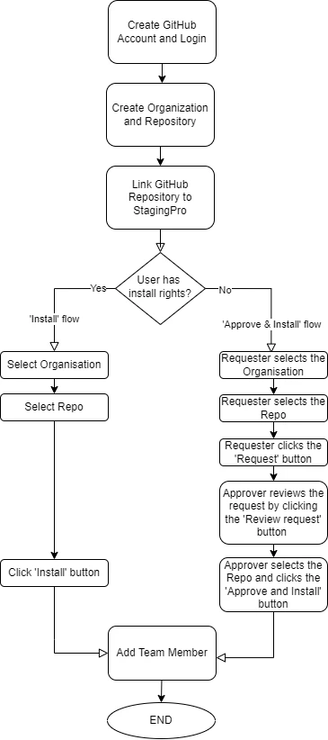

#### **Step 1: Create GitHub Account and Log In**

Sign up or log in to GitHub.

Please note that a valid GitHub ID is mandatory. If you don’t have a GitHub id, you can get one for free by clicking [here](https://docs.github.com/en/get-started/signing-up-for-github/signing-up-for-a-new-github-account).

#### **Step 2: Create Organization and Repository**

**GitHub integration pre-checks:** There are 3 important steps to cover in order to use your GitHub repository with StagingPro:

1\. **Check your GitHub repository is created under user type ‘Organisation’**

The first thing to make sure of is that your repository is created under the user type ‘Organisation’ ([https://github.com/settings/organizations](https://github.com/settings/organizations)) and <u>not </u>under a Personal Account type. If you do not yet have an organization account, then you can follow the [GitHub documentation on this subject](https://docs.github.com/en/organizations). To do this, navigate to your repositories and click “New.”

Enter a suitable “Repository Name” (as an example - **StagingPro**)

It is recommended that the repository should be ”Private.”Click “Create Repository”

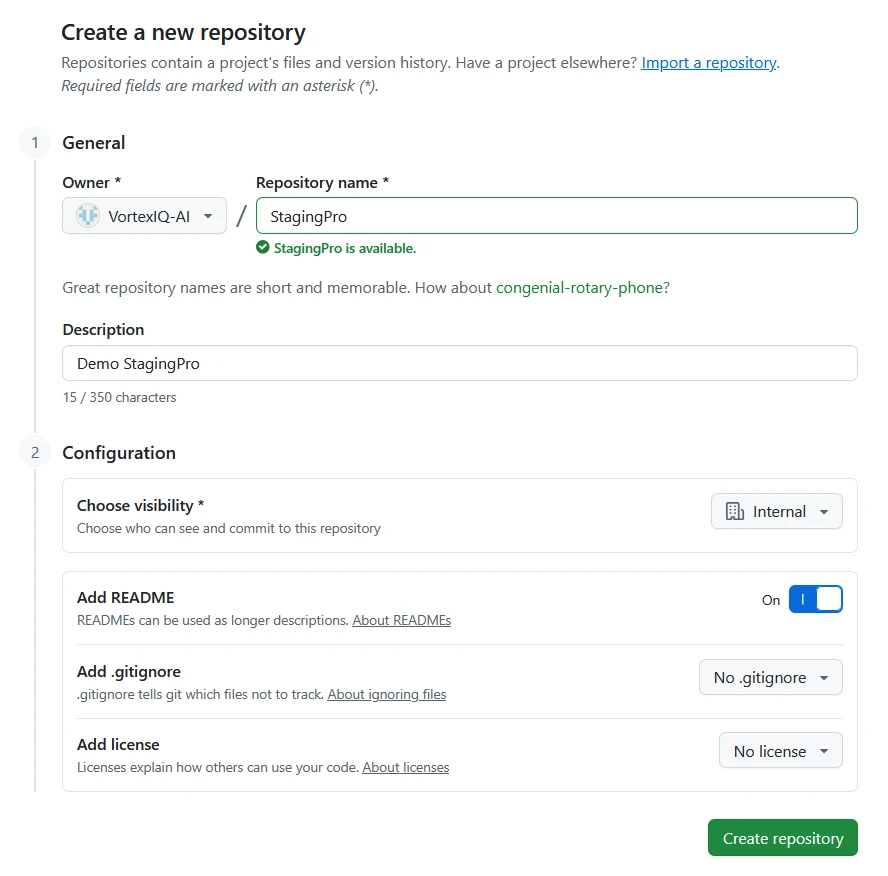

2\. **Your GitHub repository should have already selected the ‘Add a README’ file**, it **must** be selected. Otherwise you should create a new repo with the option checked. A file needs to exist in the repo, otherwise, StagingPro will not be able to create a branch and you will get an error during the StagingPro linking.

**Note:** The above should be validated, \*before\* you link your GitHub repository with your StagingPro environment

#### Step 3: Linking your GitHub repository to StagingPro.

##### **Type 1: GitHub user has app installation rights** {#type-1}

1\. Log in to StagingPro and click “Connect to GitHub App”

2\. Click on the Authorise button

3\. Then, select your Organisation

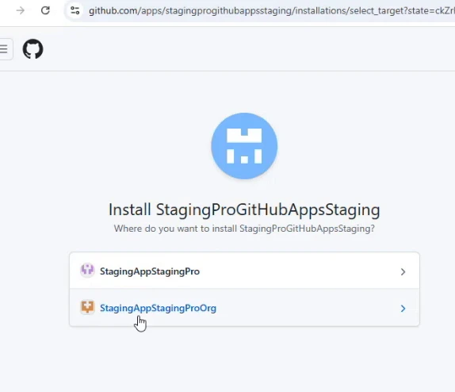

4\. Select the radio button ‘Only select repositories’, choose the respective repo from the drop down picker and click ‘Install’

5\. After redirection back to the StagingPro app, click the ‘Settings’ &gt; ‘Connect Repository’ tab to see your connected repo

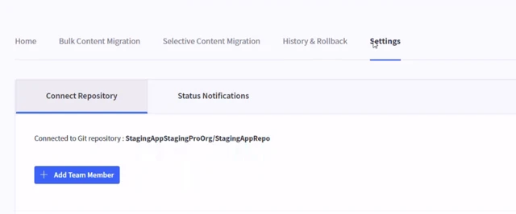

**Note:** Give 3-5 minutes for the base environment branches to be created, based on the number of channels available for each store

##### **Type 2: GitHub user <u>does not have </u>app installation rights** {#type-2}

1\. The requester (user without install rights) signs into StagingPro and clicks “Connect to GitHub App”

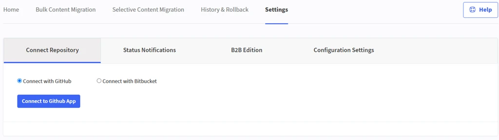

2\. The requester clicks on the Authorise button

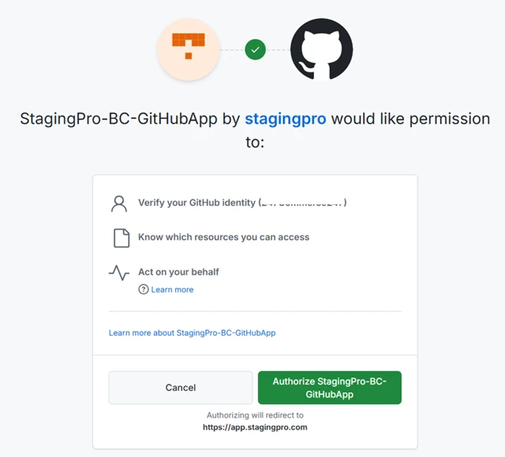

3\. Then the requester selects the organisation where the App has to be installed

4\. In this step, the requester selects the radio button ‘Only select repositories’, chooses the respective repo from the drop down picker and clicks ‘Request” button

5\. After the request is submitted, the requester will see the following notification on the Settings → Connect Repository tab on the StagingPro app

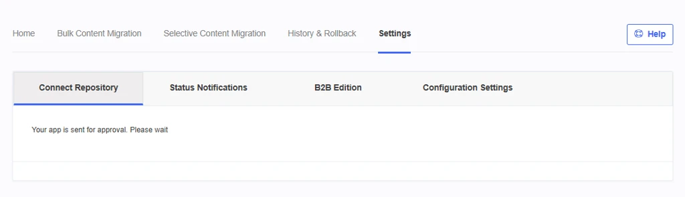

6\. Next, the approver (user with app install rights) signs into the GitHub login and clicks on the ‘Review request’ button

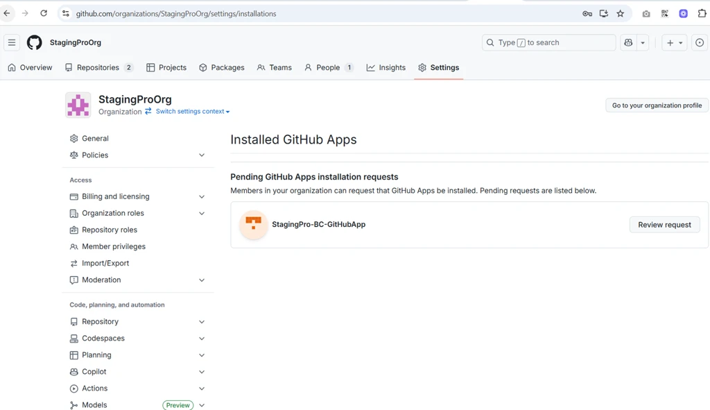

7\. **Approval:** Subsequently, the approver selects the radio button ‘Only select repositories’, chooses the respective repo from the drop down picker and clicks ‘Approve & Install’

8\. After approval, the requester will see the GitHub repo connected as shown below:

**Note:** Give 3-5 minutes for the base environment branches to be created, based on the number of channels available for each store

9\. **Rejection:** In the event, the approver rejects the GitHub App installation request, the requester can log a ticket with the helpdesk portal to reset the connection.

**Alert:** Even if the approver rejects the request, GitHub leaves an entry in the GitHub apps list which needs to be uninstalled before logging a ticket with the helpdesk portal to reset the connection.

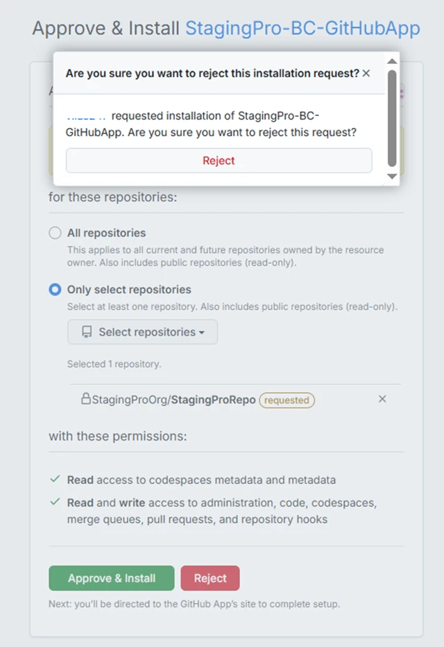

#### Step 4: Add Team Members

Then click the ‘Add Team Member’ button to specify the team member email id’s for adding the respective team member(s) to the repo and use the ‘Change Permission’ button to update the repository permissions.

You will then see an ‘Add Team Member' popup, where you can specify the GitHub email ID and Git User ID

When adding a team member their GitHub id also needs to be entered in order to add the user to the StagingPro branch for your project.

Each environment you have created will be visible and you can now specify the kinds of permissions you want to apply. You also can create a branch in any of the environments for the particular user if a new environment was added after the fact.

These permissions are based on the GitHub documentation which can be found [here](https://docs.github.com/en/organizations/managing-peoples-access-to-your-organization-with-roles).

Click Save, to add the team member

StagingPro will automatically create branches based on your linked environment setup in StagingPro. When you add Git users in the ‘Connect GitHub’ tab, it creates team member branches for each environment branch (e.g., Production, Staging, UAT etc.)

Please wait for 5-10 minutes for the branches to be created and for the theme file to be pulled into the respective user related branches

Code commits to the respective StagingPro branch, will show up in the History & Rollback &gt; Code Deployment tab

 Then click the “Add Team Member” button to specify the team member email id’s for adding a team member to the repo and use the ‘Change Permission’ button to update the repository permissions.

You can also view the Git Branch association from the Home page.

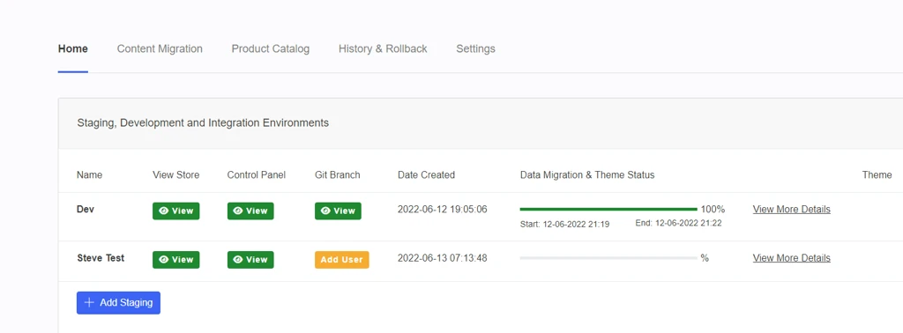

#### Step 5: Remove User

· To remove a user, click "Remove" in StagingPro. This action removes the user from StagingPro but not from GitHub.

#### Step 6: Change Permissions

· Change user permissions by navigating to the user settings and modifying their access.

· By selecting “Change Permission,” you can give each team member access to individual staging environments. It is recommended that you restrict access to your production store to only those users who actually need it.

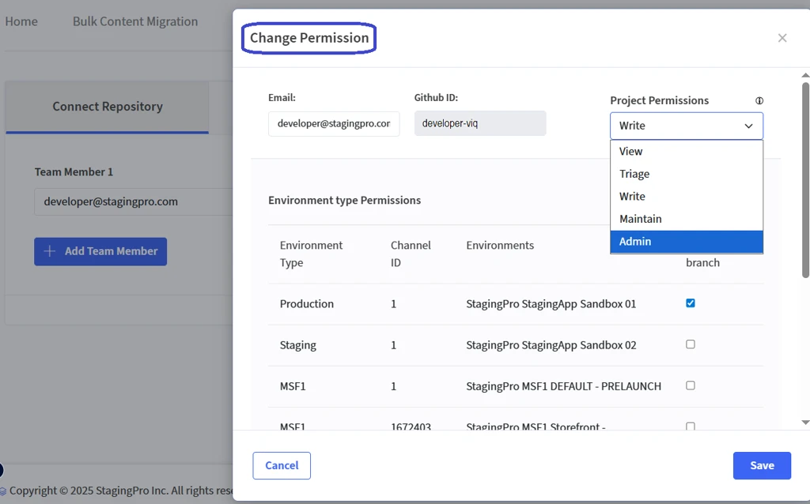

Please refer to the article - [StagingPro Deployment workflow](stagingpro-github-deployment-workflow.md) - which elaborates how to commit codes and deploy themes.

**IMPORTANT**:  Github Actions and workflow processes should be assigned to your development team who will review and fix the notifications visible on the deployment logs. Once all log items are reviewed and fixed by your development team, the StagingPro code deployments will be successful.

### A few GitHub FAQs

Q1. After giving Admin access to StagingPro Git repository, I see some autogenerated code branches e.g., Productione347c1, so should I keep the names as they are? A1. Yes, that is correct. These environment branch names are autogenerated and required for code commit tracking. Please do not delete or rename these branches as it will affect the GitHub integration.

The branches are created -

i) per environment

ii) per channel

iii) per team member

Q2. What is the purpose of developer branches? A2. As best practice, developers are given their own branches so they can commit their codes to their own branch at the first instance, or for more frequent code commits at the developers convenience without affecting the environment branch.

Q3. Are there any benefits to using a developer branch over a more typical git feature branch (e.g. feature/TICKET-description-of-the-change)? A3. Yes indeed! The developer can commit to their branch first. Once the task is complete, they can merge the code from their branch to the environment branch. If many developers are working on a common task, they can commit codes to each of their individual branches without affecting the other developer branches. And can merge their code easily.

Q4. What purpose does the Main/Master branch serve in a typical setup?  A4. Master branch is generally used as a buffer branch and is the default branch while creating a repo in GitHub. This master ‘buffer’ branch can be left as it is. Instead use the autogenerated active branches that is automatically (with a name such as Productione347c1) created during your GitHub integration and linking process.

Q5. Is there a way to export from Bigcommerce to Github through StagingPro, or do I need to download the current theme through storefront and upload it to Github separately? A5. As long as GitHub integration is connected and at a minimum, one team member user is added in the ‘Settings’ section, then yes - StagingPro automatically downloads the theme into the connected branch.

Q6. When I commit changes in Github, will those changes will appear as rollback options in StagingPro? A6. Correct. After the GitHub integration is set, commit changes are tracked and rollback options are visible on the deployments grid.

Q7. Can you explain how version control works for StagingPro with multiple development teams as part of existing CI/CD pipelines?  A7. When you successfully configure the GitHub integration on your StagingPro tenant, your GIT commits will be visible on the ‘Code Deployment’ tab which displays incremental version numbers. The code branches are created i) per environment ii) per channel and iii) per repo team member. Refer the [StagingPro Git Branch workflow](stagingpro-github-deployment-workflow.md#git-workflow) section of this document. Under Settings &gt; Status Notifications you can enable the Deployment Notifications checkbox for team notifications through i) Email ii) Teams and iii) Slack for shared visibility and effective collaboration.

Q8. Launching preview is not generating preview URL quickly, why? A8. Depending on the theme file size, generating the preview URL may take up to 5 minutes, as it requires launching a temporary server and installing the theme.

Q9. After approval, deployment is taking a lot of time. Why? A9. Deployment may take around 15 to 20 minutes, depending on the theme file size. This is because the app needs to create the theme bundle file and then upload it to BigCommerce.

Q10. When I add GitHub users via the settings panel in the app, What does this exactly do? I already have the dev team added to the main repo in GitHub so does this also need to be done? A10: When you install Staging Pro in your tenant, it creates a separate repository and separate branches; does not use your existing Git repository. When you add Git users in the ‘Connect GitHub’ tab, it gets associated with the separate repository created for Staging Pro.

Q11. Typically we use Dev branch where the developer first pushes, in the Staging Pro world should we consider staging-ENV to be our dev? A11: You can setup the environments, dependent on your company code flow process; Production and Staging if preferred. In this case, its ideal for codes to be committed and tested in staging before being moved to production.

Q12. We have some custom build actions, is there a way to run these via you or my flow should remain: PR merge \[Develop\] → Jenkins runs → Merge to staging-env, if pass. A12: Sure, as long as you make the code commit to the correct branch, it will show up in the History & Rollback &gt; Code Deployment tab.

Q13. How do you then like to promote code changes from staging → Integration and Production? Still use merges in GitHub to the named branches or via the UI? A13: The flow that is mostly used is Integration → Staging → Production. The reverse flow will also work, as long as there is no code conflict.

### Video guide:

<video height="600" width="800" controls>
  <source src="https://pub-1955da82cf7a4464b07d4fdb178ea58d.r2.dev/github/GitHub-A01.mp4" type="video/mp4">
</video>

---

!!! important
    GitHub Actions and workflow notifications must be reviewed and fixed by your development team.  
    StagingPro deployments will succeed only after all workflow issues are resolved.

---

Click here → [Understanding the StagingPro App pages](app-pages/index.md) to understand other pages of the app.

To view our Onboarding steps, please access the following article → [StagingPro Onboarding](stagingpro-onboarding/index.md)

---

[← Back to Help Center](../../index.md){ .md-button }