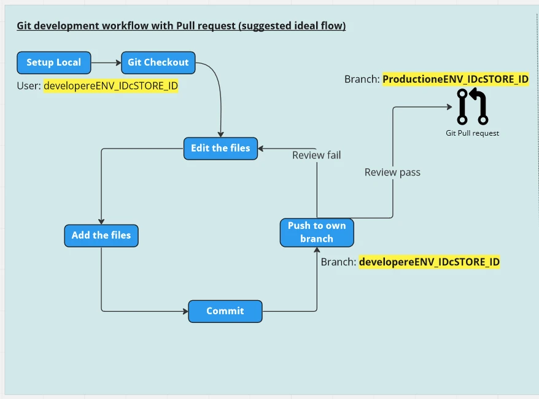
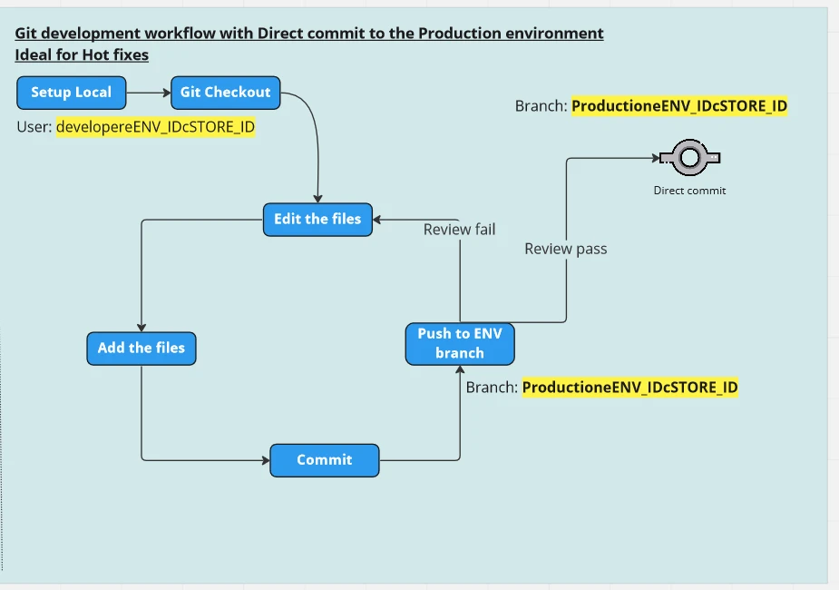
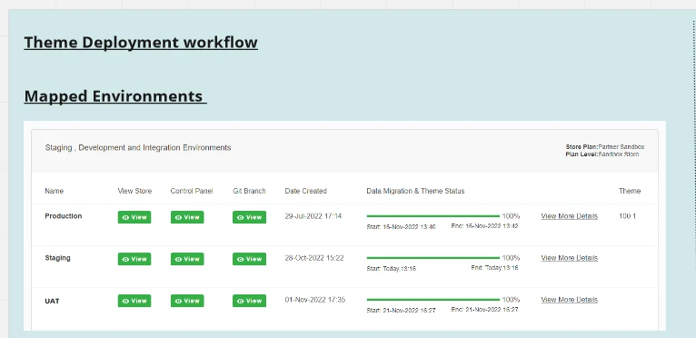
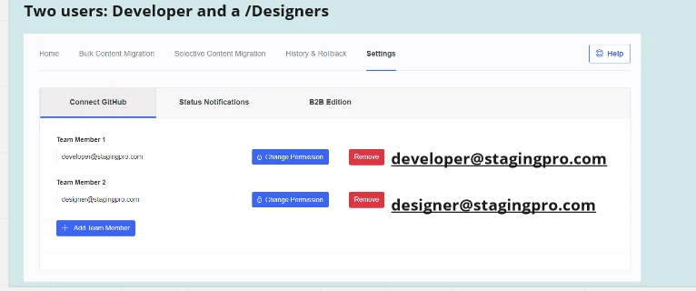
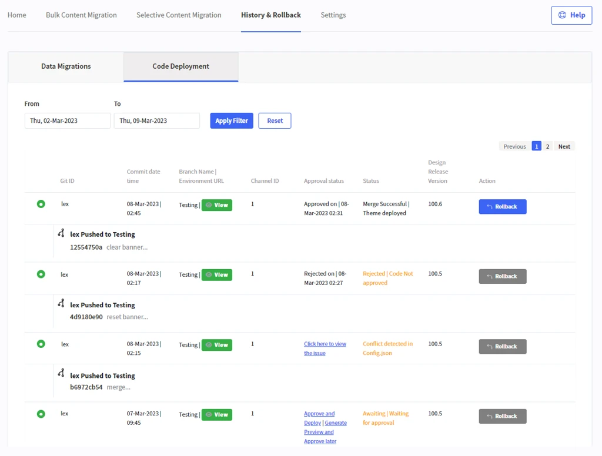
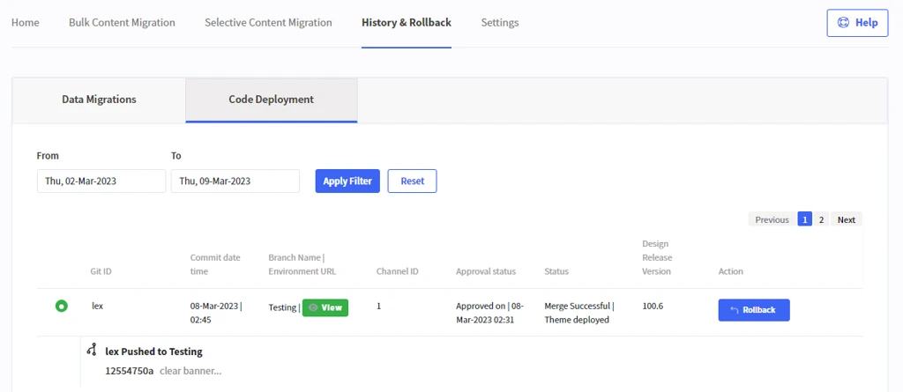
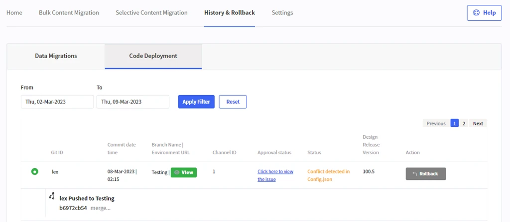
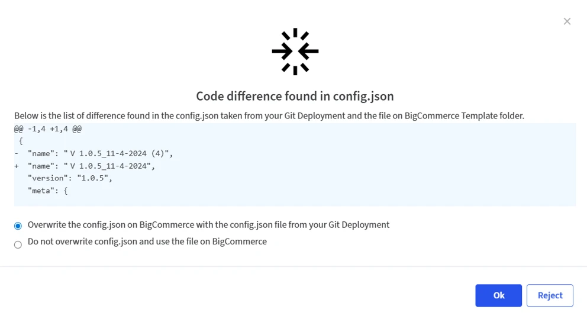

# StagingPro Theme/Code Deployment Workflow

This section explains the **recommended Git-based deployment workflow** when using **StagingPro**, including standard deployments, hotfixes, approvals, previews, and rollbacks.

---

**IMPORTANT**:  Github Actions and workflow processes should be assigned to your development team who will review and fixes the notifications visible on the deployment logs. Once all log items are reviewed and fixed by your development team, the StagingPro code deployments will be successful.

## Staging Pro Repository and Branches

Before installing StagingPro in your tenant, you need to create an organisation repository in GitHub and add StagingPro as an Admin collaborator. Then you can associate your organisation repository with your StagingPro tenant. StagingPro will automatically create branches based on your linked environment setup in StagingPro

When you add Git users in the ‘Connect GitHub’ tab, it creates team member branches for each environment branch (e.g. Production, Staging, UAT etc).

Code commits to the respective StagingPro branch, will show up in the History & Rollback &gt; Code Deployment tab

---

## Recommended Git Development Flow

### Standard Deployment (Pull Request–Based)

The following illustration represents the **ideal Git development workflow** using **Pull Requests**, implemented as part of your StagingPro setup.

---

### Hotfix Deployment (Direct to Production)

The following illustration represents the **ideal hotfix workflow**, where changes are committed **directly to the Production environment**.

---

!!! info "General Best Practice"
    Developers should first commit code to their **local or personal branch**.  
    Code is then **reviewed and approved** before being merged into a shared branch (for example, Production).

---

## Important Git Branch Rules

- Once StagingPro is linked to your Git repository:
  - Active branches are **programmatically generated**
  - **Branch names must NOT be renamed or deleted**

!!! warning "Do Not Rename Branches"
    Renaming or deleting autogenerated branches will break GitHub–StagingPro integration.

> For GitHub integration steps, refer to: [**GitHub Integration**](stagingpro-github-account-setup.md)

---

## StagingPro Git Branch Workflow {#git-workflow}

As part of the theme deployment workflow, consider a StagingPro setup with the following mapped environments:

- **Production**
- **Staging**
- **UAT**

GitHub users (for example, developer and designer) are added to StagingPro via the **Connect GitHub** tab.

---

### Git Branch Workflow Components

The following illustration highlights how these components work together:

- StagingPro repository in your GitHub Organization
- Webhook-enabled environments (Production, Staging, UAT)
- Storefront channels per environment
- GitHub users (developer, designer)
- User-specific Git branches

---

## StagingPro Git Branch Code Deployment

Navigate to:

**History & Rollback → Code Deployment**

This section displays the list of Git commits from your connected GitHub repository that are available for deployment in StagingPro.

---

## Deployment Status Scenarios

!!! Status

    === "Awaiting Approval"
	

- Git commit appears in the grid
- Approval is required before merge

**Available actions:**
- **Approve and Deploy** – deploy immediately
- **Generate Preview and Approve Later** – preview changes before approval

!!! tip 

    "Preview Generation"
	- Select the compatible **Node.js version**
	- Click **Launch**
	- Preview URL is generated within **up to 5 minutes**

!!! Status

    === "Approved & Deployed"

- Status: **Merge Successful | Theme Deployed**
- Code is merged into the respective environment branch

!!! info
	Deployment may take **15–20 minutes**, depending on theme size, as StagingPro:
	- Builds the theme bundle
	- Uploads it to BigCommerce

- A **Rollback** option is available to revert to a previous version

!!! Status

	=== "Errors or Conflicts"
	

- Conflicts (for example, in `config.json`) are detected
- Click to **view and resolve conflicts** before proceeding
- Click on Reject to cancel deployment

!!! Status

    === "Rejected"
	

- Status: **Rejected | Code Not Approved**
- No changes are merged into the environment

---

## GitHub FAQs

### Q1. I see autogenerated branches like `Productione347c1`. Should I keep them?

**Yes.**  
These branches are **required** for commit tracking and integration.

!!! warning
    Do not rename or delete these branches.

Branches are created:
- Per environment
- Per channel
- Per team member

---

### Q2. What is the purpose of developer branches?

Developer branches allow:
- Frequent commits without impacting environment branches
- Isolated development per team member
- Cleaner merges once work is complete

---

### Q3. Why use developer branches instead of feature branches?

Developer branches:
- Allow multiple developers to work independently
- Prevent conflicts between developers
- Enable easy merging into environment branches when ready

---

### Q4. What is the role of the Main/Master branch?

- Acts as a **buffer/default branch**
- Can remain unused after setup
- StagingPro uses **autogenerated environment branches** instead

---

### Q5. Does StagingPro export themes from BigCommerce to GitHub?

**Yes.**

!!! info
    Once GitHub integration is connected and at least one team member is added:
    - StagingPro automatically downloads the theme into the connected branch

---

### Q6. Do GitHub commits appear as rollback options?

**Yes.**  
All tracked commits appear as rollback options in the deployment grid.

---

### Q7. How does version control work with multiple teams and CI/CD?

- Commits appear in **Code Deployment** with incremental versions
- Branches are created:
  - Per environment
  - Per channel
  - Per team member

!!! tip "Team Notifications"
    Under **Settings → Status Notifications**, enable deployment notifications via:
    - Email
    - Microsoft Teams
    - Slack

### Q8. Why does preview launch take time to generate the preview URL?

The time required to generate a preview URL depends on the size of the theme files. In some cases, this process may take up to 5 minutes, as it involves provisioning a temporary server and installing the theme.

### Q9. Why does deployment take time after approval?

After approval, deployment may take approximately **15–20 minutes**, depending on the size of the theme files. This time is required to create the theme bundle and upload it to BigCommerce.

---

Click here → [Understanding the StagingPro App pages](app-pages/index.md) to understand other pages of the app.

To view our Onboarding steps, please access the following article → [StagingPro Onboarding](stagingpro-onboarding/index.md)

---

[← Back to Help Center](../../index.md){ .md-button }