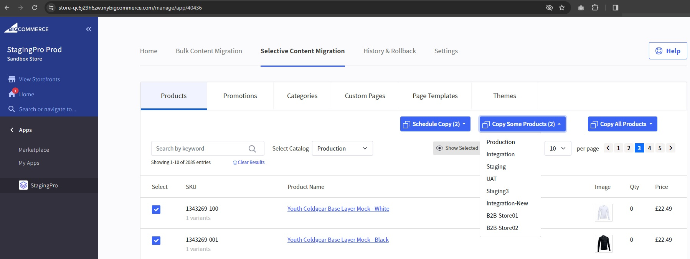
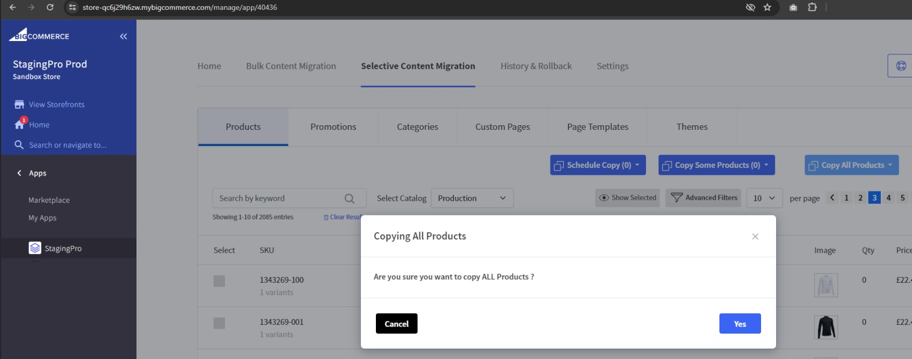
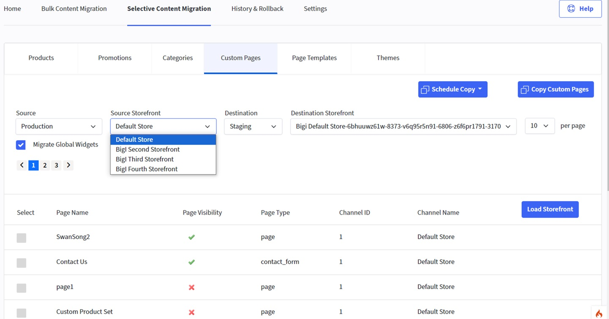
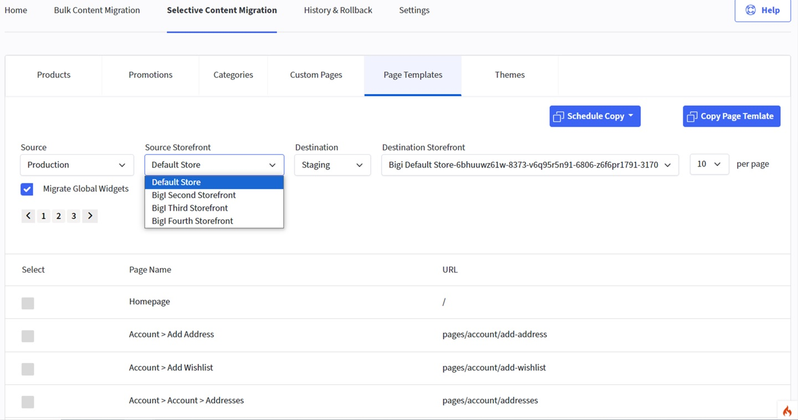
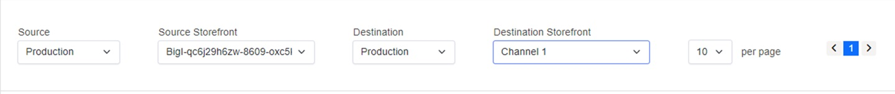
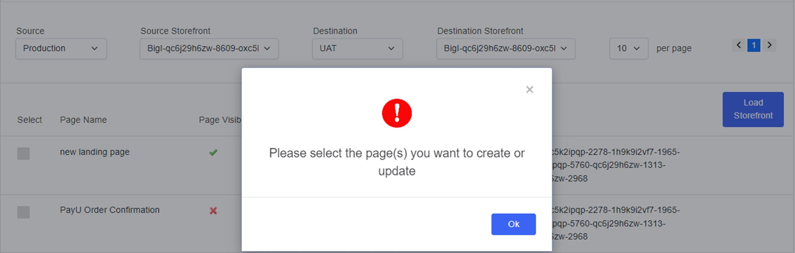
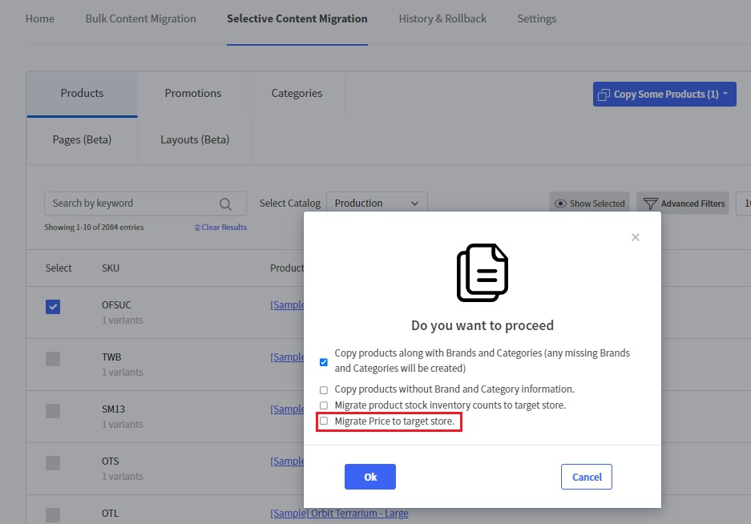
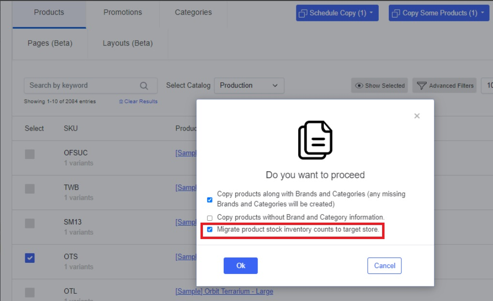
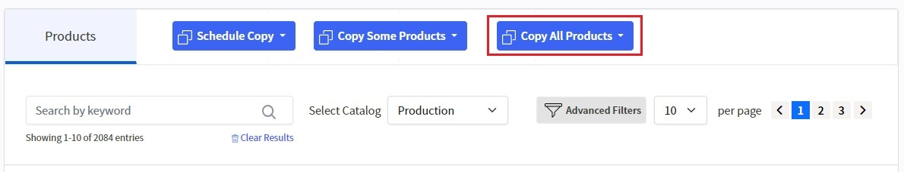

# Product Fixes and Releases

To view our Onboarding steps, please access the following article → [**StagingPro Onboarding**](stagingpro-onboarding/index.md)

The following are the product fixes and releases implemented since the StagingPro app went live.

---
## Release Notes - 16 Dec 2025

**Fixes** [STAG-1701]

- Migration of product custom template associations during product migration

- Migration of product page widgets, including image widgets and carousel image widgets

- Migration of page template layouts, including image widgets and carousel image widgets on the homepage

- Migration of product variants, categories (with automatic creation if they do not exist), and brands (with automatic creation if they do not exist)

---

## Release Notes – 26 Nov 2025
Added **Connect Agency** and **VIQ agency** sub-tabs under Settings.

---

## Release Notes – 24 Oct 2025
**GitHub Apps Feature Integration Enhancement** – Added requester + approver authorization.

---

## Release Notes – 22 Oct 2025
Added GitHub Apps integration with improved security. Deprecated Classic Token & Fine-Grained implementations.

---

## Release Notes – 26 Aug 2025

1. **Node.js Support** – Added versions **20, 22 and 24** to the Theme deployment dropdown options.

2. **GitHub Integration** – Enabled commits for repositories using **Fine-Grained Personal Access Tokens**.

---

## Release Notes – 23 Jan 2025
- Removed option to delete products in destination during bulk migration.

---

## Release Notes – 16 Jan 2025
- **Multi-storefront dropdown support** has been introduced for both **Bulk Content Migration** and **Selective Content Migration**, covering **intra-store** as well as **inter-store** migration scenarios.
- Category tree supported multi-storefront migration.

---

## Release Notes – 09 Oct 2024
### Teams Notification Integration Update
- Login to Teams: Access Apps or the three dots (⋯) menu within Teams.

- Create Workflow: Navigate to Workflow, click New Workflow, and set up the workflow.

- New Workflow Functionality: Added a new function to manage the Teams workflow within StagingPro settings.

**Fixes**

- Optimized Pages Tab: Removed redundant API calls, improving page load speed for selective content migration.

- Updated Welcome Email: Revised the welcome email template for clarity and alignment with user suggestions.

- Improved Storefront Dropdown: Fixed the dropdown to display only active storefronts related to BigCommerce.

---

## Release Notes – 12 Sept 2024
### Bitbucket Integration

- **Connect Repository**: Click on the "Connect Repository" tab under Settings and choose the option to connect with Bitbucket.

- **Verify Repository**: Verify the customer repository by entering the workspace/repository details.

- **Add Team Member**: Add a team member by entering the Bitbucket username and name.

- **Create Developer Branch**: Select the environment to create a developer branch.

- **Change Permissions**: Users can add or remove permissions for previously selected branches.

- **Remove User**: Deletes the user and associated branch information from the database.

- **Pull/Commit Entry**: After successfully committing changes or making pull requests in any developer branch, a new entry will appear under the History tab in the Code Deployment section.

- **Generate Preview**: Preview the changes before deployment.

- **Approve & Deploy**: Approve the changes and deploy them.

- **Rollback**: Rollback to a previous version if necessary..

More details here → [Bitbucket Integration](stagingpro-bitbucket-integration.md)

---

## Release Notes – 09 Feb 2024
Fix

- Under Selective Migration  > Products, selecting Products now shows the correct count for the ‘Copy Some Products’ button

- Now clicking on the ‘Copy All Products’ button, you will get a popup notification which asks you to confirm if you are sure you want to copy ALL Products.

---

## Release Notes – 30 Jan 2024
- Only one email for selective migration batch.  
- Added destination details in notifications.  
- Removed count from “Copy All Products”.

---

## Release Notes – 29 Jan 2024
**Fix**

- In Selective Content Migration, Custom Pages & Page Templates tabs added

- Page names and corresponding URLs loaded in Page Templates

- Source and destination storefronts will be loaded into the dropdown list based on the selection of corresponding source and destination store 

- “Migrate Global Widgets” checkbox added in Custom Pages & Page Templates tabs.

---

## Release Notes – 25 Jan 2024
**Fix**

#### Installation

- At first time installation any store welcome screen will be loaded .

- Enter production store hash to create association between staging and production.

#### Un-installation

- Uninstallation in production store will disassociate all staging stores implies all the list of environments in home page will be lost and welcome screen will be displayed for all the production as well as staging stores.

- Uninstallation in staging store, only particular staging store will be uninstalled and will display welcome screen.

---

## Release Notes – 30 Nov 2023
**Fix**

- Selective Content Migration default values displayed on the loading of the page - ‘production’ for store and the corresponding default storefront.

- The list of pages displayed are of the default storefront of the default store i.e., production.

- The list of pages data grid included the to display - Channel Name, Page Visibility (as tick mark) and Page Type

- For channel migration, Selective Content Migration now supports display of drop down selections for: 

    - All the source stores and corresponding source storefronts

    - All the destination stores and corresponding storefronts

**Permissible scenario:**

**Source store:** Production → **Source storefront: Channel 1**

**Destination store:** Production → **Destination storefront: Channel 2**

**Non-permissible scenario:**

**Source store:** Production → **Source storefront: Channel 1**

**Destination store:** Production → **Destination storefront: Channel 2**

- Validation Message for page selection : “Please select the page(s) you want to create or update.”

---

## Release Notes – 30 Oct 2023
**Fix**

- Applied fix to scheduled migration status tab that was not updating after completion of scheduled event.

- View details tab now opens under data migration tab if a migration has failed.

- Wrong message was showing after initiation of migration, it was showing migration completed for all entities and copy all products under Selective Content Migration.

- Migration status was directly updating to ‘Publish Completed’ right after migration initiated.

- Cron updated to reflect the latest status of migration of Selective Content Migration.

- Migration changes related to new entities in Selective Content Migration like page, layout and categories is implemented:

    - In Home tab integrated the migration API for category, page, and layout.

    - Migration was possible without selecting any category or layout entity and migration was failing. 

    - Migration for layout entity was displaying as page in History & Rollback. 

    - Page, Category and Layout header design correction. 

    - Promotion screen is not loading from category screen. 

    - When clicking on "advance filter" in product screen, other tabs were not displaying. 

---

## Release Notes – 02 Oct 2023
**New**

Additionally, the default behaviour of Selective Migration of Products <u>won't include</u> product prices. So if you wish to migrate the product prices, please select the popup checkbox option **‘Migrate Price to target store’** prior to migration

---

## Release Notes – 12 Sept 2023
**New**

Now the default behaviour of Selective Migration of Products wont include product inventory stock counts. If you wish to migrate the counts, please select the popup checkbox option ‘Migrate product stock inventory counts to target store’ prior to migration

---

## Release Notes – 05 Sept 2023
**New**
New

Selective Migration of Categories is now available for your use.

---

## Release Notes – 18 Aug 2023
**New**
Selective Product Migration now features the **Copy All Products** button, which means you can run a selective update on all products now.

---

## Release Notes – 03 Aug 2023
Promotion coupon codes migration now supported for bulk and selective migration.

---

## Release Notes – 01 Aug 2023
**New**

- Selective Migration for Products now migrates Product Metafields and Product Reviews along with the products.

- Fix applied for migrating product variants in batches for successful migrations (Bulk and Selective)

---

## Release Notes – 24 May 2023
Selective Migration for [Pages & Layouts](selective-content-migration/pages&layouts.md).

---

## Release Notes – 25 Apr 2023
**Fix**

- Users can select the corresponding NodeJs version to deploy or generate a preview of the store.

- Users can cancel a deployment if it is stuck for any reason.

- Users can view the logs for all successful, rejected by user and failed deployments.

- The temporary preview server will automatically terminate once the deployment is completed.

- StagingPro will support NodeJs versions from 14 to 18.

- The deployment and preview generation process is now 40% faster and mostly under 3 minutes to complete.

- Logs generated during deployment can be viewed even if they contain special / junk characters.

- Users can test their theme with different NodeJs versions by generating a preview without affecting the Production environment.

---

## Release Notes – Nov 2022 (v2.0.4)
**New**

- StagingPro Channel Assignment and Updates. User interface updates to group Storefronts and Channels on the Content Migration screen. STAG-266    . 

- - Channel movements popup changes to show mapped storefronts and channels. STAG-276 and STAG-35    9 .

- Bundle B2B Settings screen. STAG-362
    - Bundle B2B Content Migration screen. STAG-363
    - Bundle B2B migration status reflection on the 'Home' tab and 'History & Rollback > Data Migrations' tab STAG-364

- Promotions for 'Selective Content Migration' STAG-368

- Improve the logging system in all screens related to migration(content, product, history). STAG-384

- Rename 'Store Coupons' to 'Coupon Codes'STAG-387

- Change in code flow for scheduled migration and listing schedule migration under the content migration tab. STAG-389

- Individual Theme migration from Source to Destination - Design, API. STAG-399

- Send out an onboarding email once a user installs the StagingPro app. STAG-400

- Updated API for StagingPro Migration History Log. STAG-401

- Individual Theme migration from Source to Destination, including inactive themes - Backend apps development. STAG-404

- Integration of Schedule for Selective Promotion functionality under product catalog screen. STAG-406

- Listing of migrated promotion data in History Screen under the data migration tab and Home screen. STAG-407

- Updates for Cross-Domain Scripts Included. STAG-409

- End-to-end regression testing for release v2.04. STAG-414

**Fix**

Remove unrequired hyperlinks from add Staging popup. STAG-402

---

## Release Notes – Nov 2022 (v2.0.3 – Security Updates)
**Improvement**

- CVSS 8.5 - Stored Cross-Site Scripting fixes.

- CVSS 8.1 - Reflected Cross-Site Scripting fixes

- CVSS 6.1 - jQuery-UI version upgraded to 1.13.2.

- CVSS 4.7 – Updated Security Headers.

- CVSS 4.3 - Added TLS Cookie (session) Secure Flags.

- CVSS 3.7 – Enhanced Insecure TLS/SSL Configurations.

- CVSS 3.0 - Included Cross-Domain Scripts.

---

## Release Notes – Nov 2022 (v2.0.2)
StagingPro now supports both code commit and git pull requests in the deployment workflow.

**Improvement**

- Support for Direct code committed to any of the connected environments.

    - Generated preview will be based on committed code in the environment Git branch.

    - 'Approve & deploy' action will deploy the codebase from committed code in the environment Git branch.

- Generate pull requests from one environment to another.

    - Generated preview will be based on pull requests code in the environment Git branch.

    - 'Approve & deploy' action will deploy the codebase from pull requests code in the environment Git branch.

---

## Release: Oct-2022 v2.0.1 - Schedule migration & Optimized theme deployment flow

**Summary**
Big news today, we're releasing new improvements and fixes for StagingPro.

**New** 

- Schedule content migration. [STAG-306]

- When a new Staging Environment is added, and Production data is moved, the first-time migration data was not appearing on History and rollback and also on the homepage as it is not manually triggered from the User Interface. This has now been added to show the migration data on all interfaces. [STAG-371]

**Improvement**

- Optimized to handle multiple deployments at the same time.

- Update all exceptions and show them on Frontend.

- When products are moved between environments, do not show the option to delete from PROD. This will help avoid any accidental deletion of the product catalog from the Production store. [STAG-336]

- Added guest token in product URL on click to view details under history and home screen. [STAG-343]

- Code Optimization and refactoring on the StagingPro frontend app. [STAG-346]

- Staging count logic Implementation to restrict the screen visibility as per the user plan and move the staging count value in the configuration file. [STAG-377]

**Fix**

- Channel Assignment and Channel [STAG-276] Movement popups

- Set the "Default" Source Environment option as 'Please Select' on the content migration page. [STAG-301]

- Implemented partner plan level information before sending approval of production requests. [STAG-296]

- Internal documentation for flow diagrams for all controllers and helpers. [STAG-345]

- Minutes and Hours issue in the view errors popup was fixed

- Show pop with inactive themes and add functionality to delete the inactive themes. This is done so that a user can delete old themes to add new ones from the user interface when it exceeds 20 themes within a store [STAG-262]

- Change permission for Git users' on the setting screen. [STAG-342]

- Content Migration pre-load. [STAG-366]

- [STAG-367]
    - Fixed issue where migration task status was 'Completed,' but the progress bar wasn't updated
    - Updated the field label for SKU.
    - Fixed a bug where the SKU display value was missing.

**Backlog Items**

- Checkbox should be disabled in content migration while initiating the migration.

- When we cancel on the add team member page, it should refresh automatically to remove old data.

- Improve the logging system in all screens related to migration(content, product, history)

- Under change permission, remove checkbox permission is not working.

---

Click here → [Understanding the StagingPro App pages](app-pages/index.md) to understand other pages of the app.

To view our Onboarding steps, please access the following article → [StagingPro Onboarding](stagingpro-onboarding/index.md)

---

[← Back to Help Center](../../index.md){ .md-button }