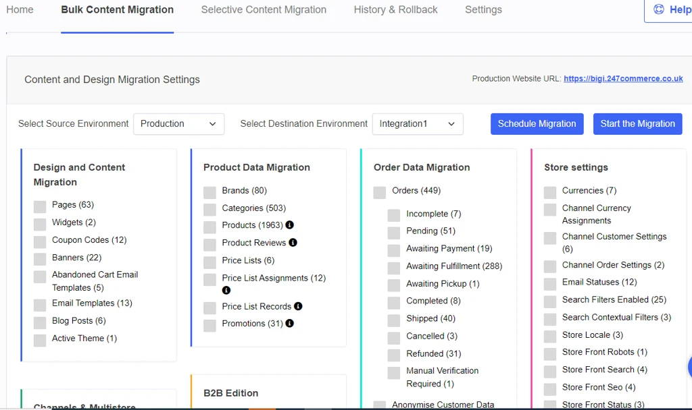
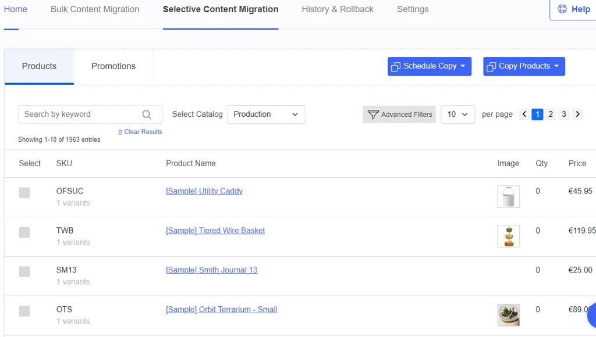
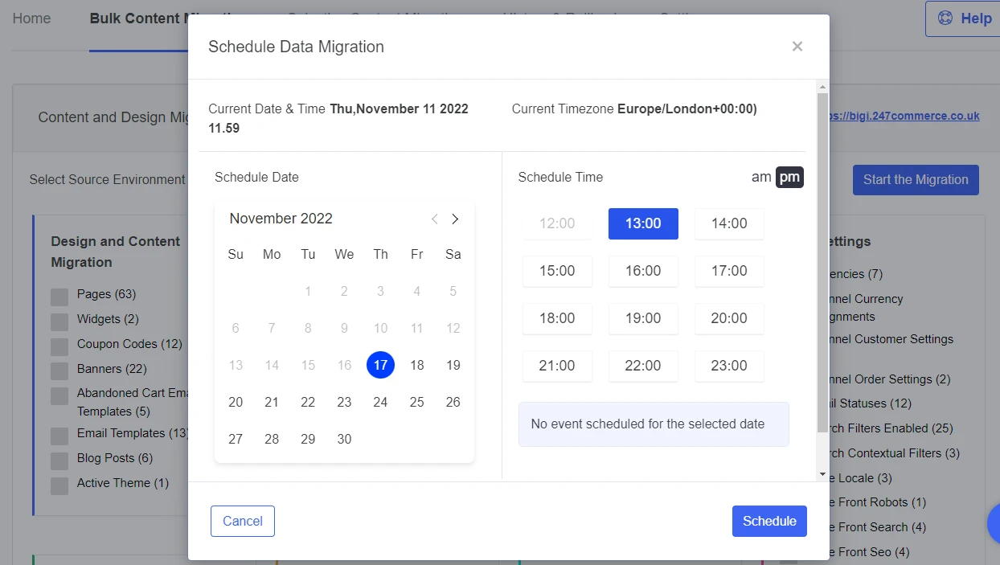
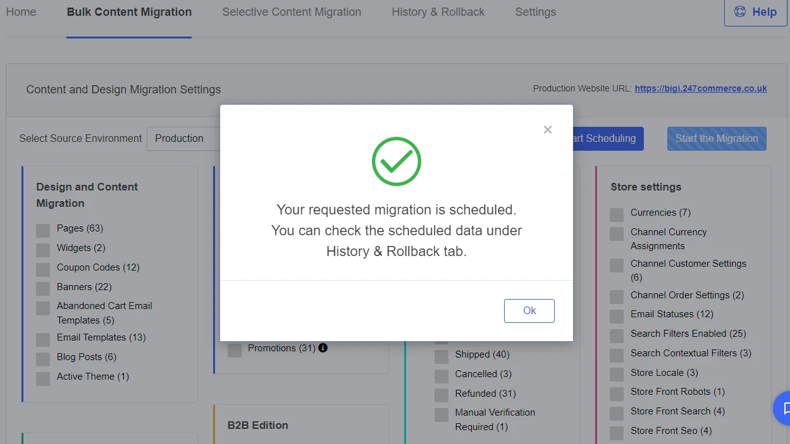

# Scheduling

Scheduling functionality is provided on the **Premium Tier**.

Content migration from Bulk and Selective migration has the option to Schedule the movement of data between a Source and a destination store environment.

## **Scheduling Bulk Content Migration:**

a) Select the source environment and destination environment

b) Select checkboxes from the Product Data Migration column and then click on the Schedule Migration button

c) A popup window with calendar and timings will be displayed for select

d) After selecting the date & time, click on the schedule button

e) Once a data element migration has been scheduled, it will also show on the app's History and Rollback&gt; Scheduled Migration screen.

You can see the status of the schedule under History & Rollback.

Moreover, you can cancel the schedule under the Action column by clicking on the ‘Cancel schedule.’

## **Scheduling Selective Content Migration:**

Similarly, using the Selective Content Migration screen also, the data entities can be scheduled.

Message will be displayed as follows:

For each checkbox, you will find a single entry on the History & Rollback screen.

---

Click here → [Understanding the StagingPro App pages](app-pages/index.md) to understand other pages of the app.

To view our Onboarding steps, please access the following article → [StagingPro Onboarding](stagingpro-onboarding/index.md)

---

[← Back to Help Center](../../index.md){ .md-button }