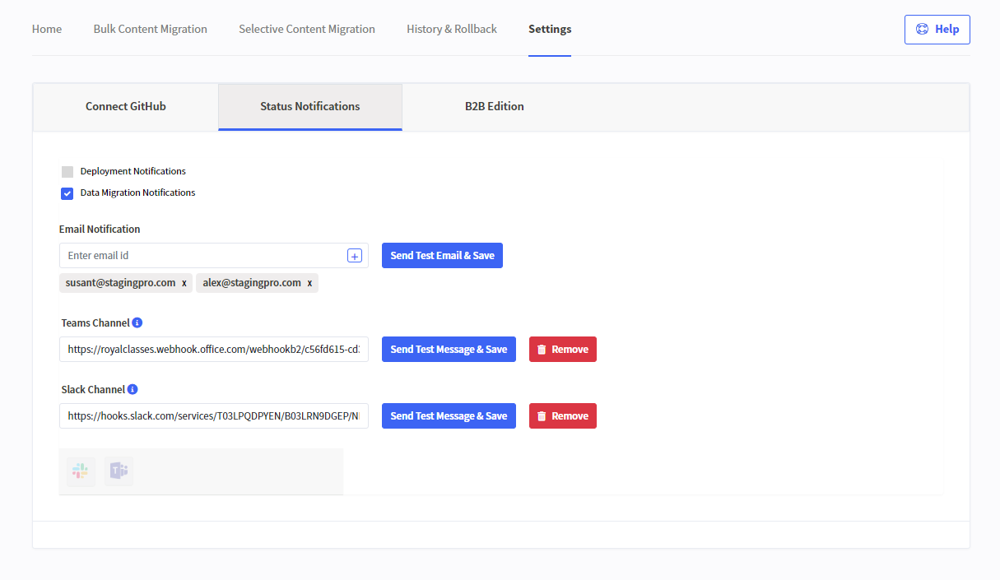
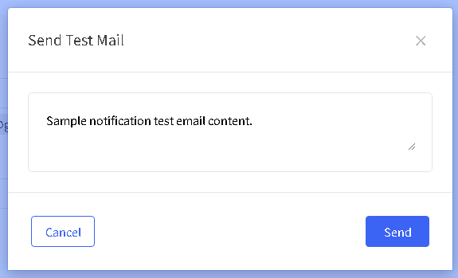
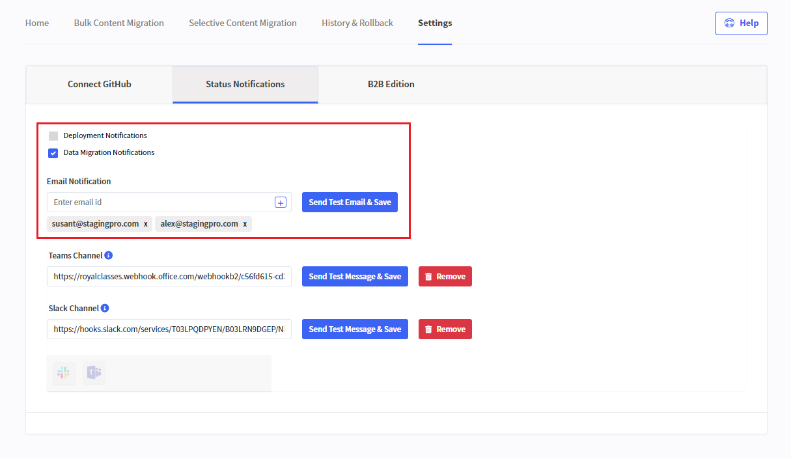

# Setup notifications (Email, Teams, Slack)

Being notified when the status of an environment changes is an important part of managing a development project. StagingPro has a number of notification methods of which email is one.

In order to set up email notifications, navigate to the “Settings” tab and click on “Status Notifications”

 Enter your email address in the “Email Notification” text box. You can add additional email addresses by clicking the “+” sign.

You can then choose to select ‘Deployment Notifications’ and/or ‘Data Migration Notifications’.  You can use the “Send Test Email” button to bring up a text box where you can add a message and send it to all the email addresses you have specified

!!!
   **IMPORTANT**: Do not forget to click the “Send Test & Save” button at the bottom of the page.

### **For changes to mail checkboxes and email notifications settings**

Please click the ‘Send Test Email & Save’ button

### **For changes to Teams Settings**

Please click the ‘Send Test Message & Save’ button

### **For changes to Slack Channel Settings**

Please click the ‘Send Test Message & Save’ button

---

Click here → [Understanding the StagingPro App pages](app-pages/index.md) to understand other pages of the app.

To view our Onboarding steps, please access the following article → [StagingPro Onboarding](stagingpro-onboarding/index.md)

---

[← Back to Help Center](../../index.md){ .md-button }