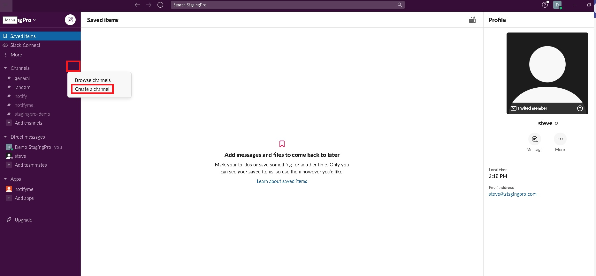
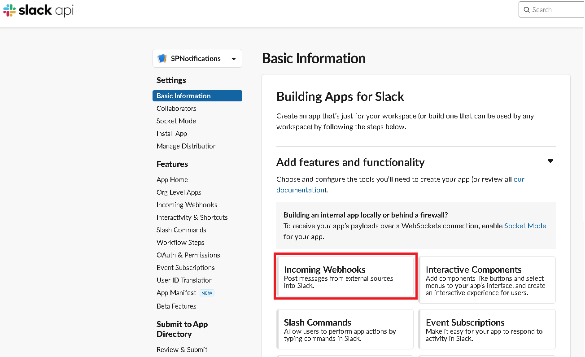
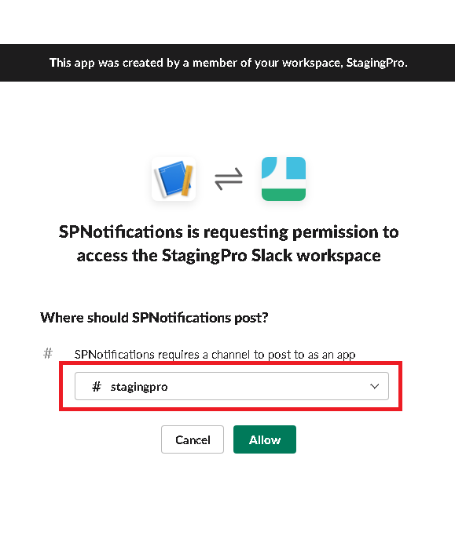
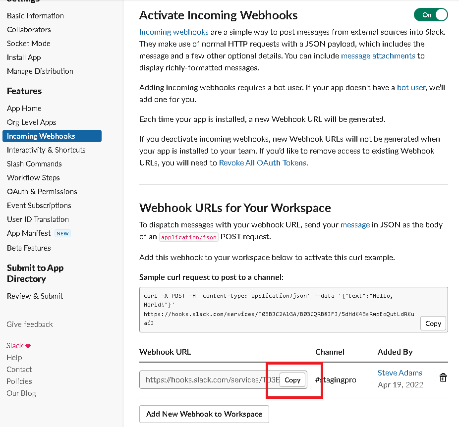
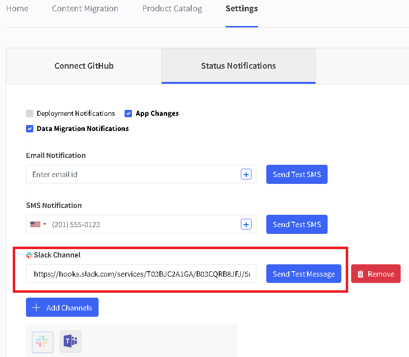

# Setup notifications in Slack

## **Introduction**

Communication between team members is vital in any development project, and keeping in touch with teams working remotely and across different time zones is more important than ever. StagingPro has the native ability to send notifications to Slack (and other channels) each time a deployment event occurs.

## **Setting up the Slack channel**

This document assumes that you already have Slack installed in your organization. You will find detailed instructions here if you need assistance downloading and installing Slack.

**Step 1**: Click on the "…" next to the "Channels" menu item.

**Step 2**: Select "Create a channel" from the popup menu

**Step 3**: Give your channel a unique name and click "Create"

**Step 4**: If everybody in your organization is going to have access to the StagingPro notifications, then you can leave the default "Add all members of \[your Slack name\]" and click the "Add" button. Alternatively, type the user names of each individual you would like to be part of this channel and click "Add."

The new channel is created, and you will see it displayed in the left-hand menu.

## **Creating the app**

Before you can link StagingPro to Slack, we first need to create a connector (or webhook) that listens for incoming messages. To do this, we need to create an app.

**Step 1**: From a new browser window, go to [api.slack.com](http://api.slack.com)

**Step 2**: Click the "Create an app" button.

**Step 3**: When the Create an app window appears, select "From scratch"

**Step 4**: Give your app a good name and choose your company's Slack workspace in the dropdown menu.

IMPORTANT: If the workspace dropdown is empty, you must go back to [api.slack.com](http://api.slack.com) and log into Slack.

**Step 5**: Click on “Create App”

**Step 6**: Under "Add features and functionality," select "Incoming Webhooks" and click "Save Changes" at the bottom of the screen.

**Step 7**: Make sure that the "Activate Incoming Webhooks" toggle is set to "On" and click "Add New Webhook to Workspace" at the bottom of the page.

**Step 8**: A security message will appear asking your permission to access your Slack workspace. Use the dropdown menu to select the channel you created in Setting up a slack channel and click "Allow."

**Step 9**: Once redirected to the previous page, use the "Copy" button to add the newly generated link to the clipboard. Either paste this link somewhere you will find it again or continue to the next section.

## **Connecting the app to StagingPro**

**Step 1**: Open the StagingPro app, navigate to Settings, and then "Status Notifications"

**Step 2**: Click on "Add Channel" and select the "Slack" icon.

**Step 3**: Paste the URL you copied in the previous section into the Slack channel text box and click on Send Test Message.

**Step 4**: Provide a test message and click "Send"

**Step 5**: Go back to your Slack channel and make sure the message you have just sent has appeared.

---

Click here → [Understanding the StagingPro App pages](app-pages/index.md) to understand other pages of the app.

To view our Onboarding steps, please access the following article → [StagingPro Onboarding](stagingpro-onboarding/index.md)

---

[← Back to Help Center](../../index.md){ .md-button }