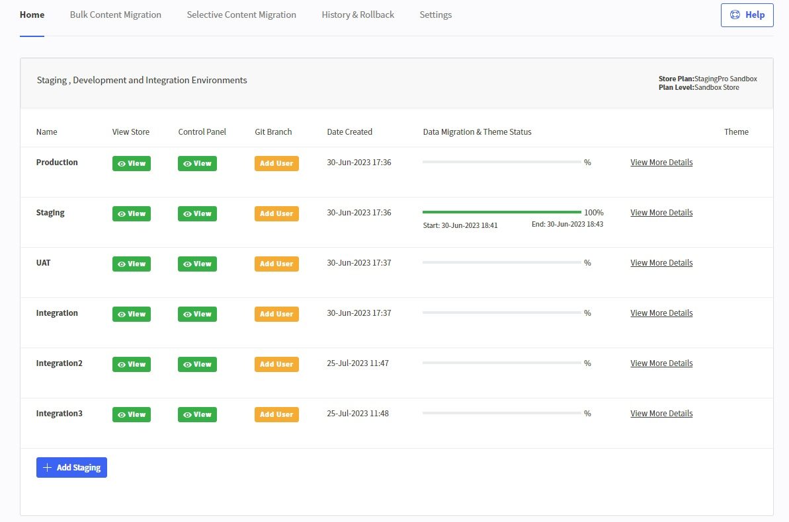

# Understanding the Home Page

The home page gives you an overview of the status of all environments that you have created.

This shows you a list of all your StagingPro environments.

- **View Store** — allows you to preview the frontend of the respective BigCommerce store environment  
- **Control Panel** — allows you to preview the backend Control Panel of the respective BigCommerce store environment  
- **Add User** (Git Branch only) — applies only to GitHub integration (used when GitHub is selected for branch merge/workflow under the **Settings** tab)  
- **Date Created** — shows the date of the latest migration task  
- **Data Migration & Theme Status** — shows the migration start and end dates/times, along with a progress bar

Clicking the **View More Details** link displays:

- migrated entities  
- counts  
- migration status  
- errors (if any)

**Theme** column displays applicable theme versions (if any).

---

Click here → [Understanding the StagingPro App pages](app-pages/index.md) to understand other pages of the app.

To view our Onboarding steps, please access the following article → [StagingPro Onboarding](stagingpro-onboarding/index.md)

---

[← Back to Help Center](../../index.md){ .md-button }